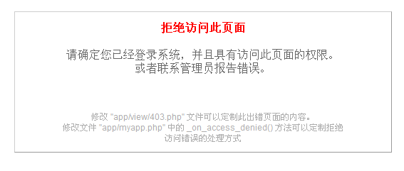

# 实现访问控制
在了解 ACL 的原理和机制后，我们现在来为 todo 应用加上访问控制功能。

## 为控制器指定访问规则


默认情况下，所有的访问控制规则都书写在 acl.yaml 中，该文件的结构如下：


```yaml
控制器名称:
  allow: 允许使用该控制器的角色
```

例如：


```yaml
tasks:
  allow: 'MEMBER'
```

表示只有具有 MEMBER 角色的用户才可以使用 tasks 控制器。依次类推，我们可以给每个要限制访问的控制器都指定规则。


```yaml
posts:
  # 多个角色用逗号分割就可以了
  allow: 'MEMBER, ADMIN'
 
tasks:
  allow: 'MEMBER'
 
comments:
  allow: 'MEMBER'
```

但有时候系统中存在较多的角色，此时我们只希望禁止特定角色的用户，可以使用 deny 来指定禁止访问的角色：


```yaml
users:
  deny: 'ADMIN'
```

表示具有 ADMIN 角色的用户不能够使用 users 控制器。

## 为动作指定访问规则
实际开发中，经常都会出现某个控制器的多个动作，有些允许这部分角色访问，某些又允许其他角色访问。例如 users 控制器的 changePasswd、logout 动作就只有登录后的用户访问，而 register 和 login 只有未登录的用户才可以访问。

我们可以这样指定 ACL：

```yaml
users:
  actions:
    changePasswd:
      allow: 'MEMBER'
    logout:
      allow: 'MEMBER'
    register:
      allow: ACL_NO_ROLE
    login:
      allow: ACL_NO_ROLE
```

ACL_NO_ROLE 是一个 QeePHP 预定义的值，表示不具备任何角色的用户。而未登录的用户是肯定没有角色的，因此就实现了只有未登录用户才可以使用 register 和 login 动作的目的。

但是上面的书写方法在控制器中有很多动作时就显得啰嗦了，我们可以简化为：


```yaml
users:
  allow: ACL_NO_ROLE
  actions:
    changePasswd:
      allow: 'MEMBER'
    logout:
      allow: 'MEMBER'
```

直接为控制器指定访问规则。该规则也会应用到 users 的所有动作上。但这个默认规则可以通过单独指定来覆盖，所以在访问 changePasswd 和 logout 动作时还是以我们指定的为准。

上面的规则也可以写成：


```yaml
users:
  allow: 'MEMBER'
  actions:
    register:
      allow: ACL_NO_ROLE
    login:
      allow: ACL_NO_ROLE
```


两者的区别在于后者为 users 的所有动作默认指定了必须有 MEMBER 角色才能访问，而 register 和 login 两个动作例外。这种写法相对于前一种更安全。因为你在 users 控制器中新添加的动作如果是需要授权的，那么可能因为忘了单独指定规则而造成安全漏洞。

## 为 todo 应用加上访问规则

现在为 todo 应用加上访问规则。编辑 configs/acl.yaml：

```yaml
users:
  allow: ACL_HAS_ROLE
  actions:
    register:
      allow: ACL_NO_ROLE
    login:
      allow: ACL_NO_ROLE
```

这里又出现了一个新的 QeePHP 预定义值“ACL_HAS_ROLE”，用来表示任何角色。因此上面规则的意思就是只要具有角色的用户都可以访问 users 控制器的动作。而 register 和 login 动作只能由没有角色的用户访问。

现在我们来试验一下。在未登录状态下访问 <http://localhost/todo/public/index.php?controller=users&action=changepasswd>，可以看到如下画面：



这说明我们的 ACL 已经起作用了。再访问 <http://localhost/todo/public/index.php?controller=users&action=register> 则可以看到注册页面，说明对 register 和 login 动作指定的规则成功覆盖了 users 控制器的默认规则。


## 改进访问控制的错误处理
上面的错误提示信息显然不够友好，我们需要定制这些错误信息，以便更好的引导用户正确使用我们的应用程序。

打开 app/myapp.php 文件，找到 _on_access_denied() 方法，修改内容为：


```php
protected function _on_access_denied()
{
    $roles = $this->currentUserRoles();
    if (empty($roles))
    {
        // 如果当前用户没有角色，则转到登录页面
        return new QView_Redirect(url('users/login'));
    }
 
    ....
}
```

这样在未登录用户访问不具备权限的页面时，将自动重定向到登录页面。而已经登录的用户则仍然显示错误信息页面。我们可以进一步修改 app/view/403.php 来定制更有意义的错误信息显示。

## 指定全局默认规则
随着开发的进行，我们会添加更多的控制器，为了避免因为忘了添加规则导致出现安全漏洞，我们可以将所有控制器的默认规则指定为不允许任何人访问。

在 acl.yaml 中增加：

```yaml
ALL_CONTROLLERS:
  deny: ACL_EVERYONE
```

ALL_CONTROLLERS 表示所有的控制器，而 ACL_EVERYONE 表示任何人（不管用户有没有角色）。修改以后，当新增了控制器，这个控制器默认是不允许访问，这样可以提醒我们记得为控制器指定必要的访问规则。

## 完善 todo 的访问控制规则
下面我们把 todo 应用的完整访问规则写出来：

```yaml
users:
  allow: ACL_HAS_ROLE
  actions:
    register:
      allow: ACL_NO_ROLE
    login:
      allow: ACL_NO_ROLE
 
tasks:
  allow: ACL_HAS_ROLE
 
default:
  allow: ACL_EVERYONE
 
ALL_CONTROLLERS:
  deny: ACL_EVERYONE
```


