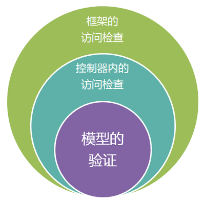
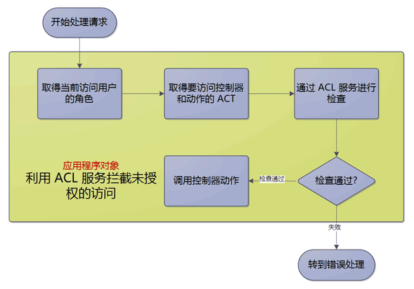

# 为什么要使用访问控制
一个现实世界中的应用程序总是会限制某些功能只对部分用户开放。例如删除文章的功能只有作者和管理员可以使用。

访问控制的目的就是为应用程序外围增加一个检查机制。只有通过检查的请求才会被应用程序处理。这样一来，就将绝大部分没有授权的请求挡在了应用程序之外。

## 多个层次的安全检查
QeePHP 框架提供的访问控制功能处于控制器外围。因此没有通过检查的请求不会被控制器所接收到。而更进一步的检查，需要开发者在控制器和模型内部来做。这就形成了一个多层次的安全检查：

上述的三个主要层次中，QeePHP 提供的 ACL 服务实现了最外围的检查。而 ORM 系统的自动验证机制帮助解决了内核的大部分安全检查工作。只有控制器内的安全检查需要开发者自己实现。

QeePHP 提供的 ACL 服务采用“基于角色的访问控制”机制实现，能够满足绝大部分情况的使用。下面我们简单了解一下什么是“基于角色的访问控制”。

## 基于角色的访问控制
基于角色的访问控制，通常简写为 RBAC（Role-Based Access Control）。我们用一个生动的故事来描述 RBAC 的核心思想。

>ATM 机的一天

>假设有一台 ATM（自动提款机）放在街边，我们来看看这个 ATM 度过的一天。

> 1. 早上，有一个家伙走到 ATM 面前，对着机器说：“芝麻开门，芝麻开门，给我 100 块！”。很显然 ATM 不会有任何动作。失望之余，这个家伙踢了 ATM 一脚走了。
2. 中午，一位漂亮的 Office lady 走到 ATM 机面前，放入她的信用卡，输入密码后，取出了 1200 块钱。当然，这些钱很快就会变成一件衣服或是化妆品。
3. 下班时分，银行的工作人员来到 ATM 机器面前，放入一张特制的磁卡，然后输入密码。从中查询到 ATM 机器内还有充足的现金，无需补充。所以他很高兴的开着车去下一台 ATM 机器所在地了。

现在我们要开发一台具有同样功能的 ATM 机，应该怎么做呢？

首先，我们的 ATM 机不能让人随便取钱，不然银行会破产的。接下来，ATM 机需要一个让人们放入磁卡并输入密码的设备。人们放入磁卡并输入密码后，ATM 机还要能够判断这张磁卡的卡号和密码是否有效，并且匹配。之后，ATM 机必须判断磁卡的卡号属于哪种类型，如果是信用卡，那么则显示查询账户余额和取款的界面。如果是特制的磁卡，则显示 ATM 机内的现金余额。

## ATM 与 RBAC
上面的例子显得有点荒诞，但是却是一个典型的基于角色的访问控制。

1. 对于没有磁卡或者输入了错误密码的用户，一律拒绝服务，也就是不允许进行任何其他操作；

2. 如果输入了正确的密码，必须判断用户输入哪一种类型（普通用户还是银行工作人员），并提供相应的服务界面；
3. 如果用户尝试访问自己不能使用的服务，那么要明确告诉用户这是不可能的。

这个流程中，一共出现了两种角色：**信用卡用户和管理卡用户**。而那些没有磁卡的用户，都属于没有角色一类。RBAC 要能够工作，至少需要两个数据：**角色信息（Roles）和访问控制表（Access Control Table）**。

角色信息通常是指某个用户具有的角色，例如你持有一张信用卡，那么你就具有“信用卡用户”这个角色。如果你持有一张管理卡，那么你就具有“管理卡用户”这个角色。如果你既没有信用卡，又没有管理卡，那么你就没有上述两种角色。

有了角色信息，RBAC 系统还需要一个访问控制表。访问控制表是一个检查清单，列出了不同角色的用户可以做和不能做的事情。例如在 ATM 机中，具有“信用卡用户”角色，就可以使用查询账户余额和取款两项功能；而具有“管理卡用户”角色，就可以使用查询 ATM 机内现金余额的动能。

我们来模拟一次 ATM 机的操作：

1. 师太有一张信用卡，他放入 ATM 机并输入了正确的密码。这时，他被 ATM 机认为具有“信用卡用户”角色。
2. 根据上面的判断结果，ATM 机显示了一个操作界面，上面有查询账户余额和取款两项操作按钮。
3. 师太按下了“查询账户余额”按钮，ATM 机的查询账户余额功能被调用。
4. 在查询账户余额功能中，再次检查用户的角色信息，确定他可以使用这个功能。
5. 进行一系列操作，然后将师太信用卡账户上的余额数字显示到屏幕上。
6. 师太很郁闷他的信用卡又透支了，悻悻然取出卡走人了。这时 ATM 自动清除当前的角色信息，为下一次操作做好准备。

从上面可以看出，RBAC 充当了系统的一道安全屏障。所有的操作都需要进过 RBAC 验证过后才能使用。这样充分保证了系统的安全性。

具体到应用程序，RBAC 实际就是限制了没有权限的用户不能访问哪些受保护的控制器动作方法。例如不具备管理员角色的用户是不能使用 admin 控制器的。

ACL 服务

理解了基本概念，我们再来理解 ACL 服务就容易多了：

上述整个流程都是自动完成的，不需要开发者干预。当然有必要的话，开发者可以自己修改应用程序对象来进行定制。

