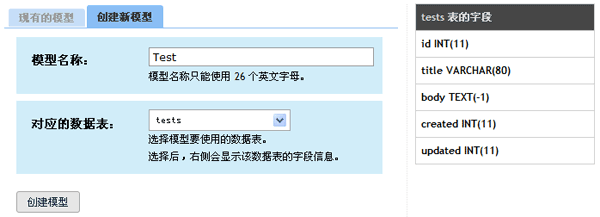

# 创建模型
WebSetup 除了可以创建控制器，还可以从数据表直接创建匹配的模型。下面我们做个简单的测试。

## 创建数据表
在 phpMyAdmin 中选中先前创建的 todo_db 数据，然后执行下列 SQL 命令：

```sql
CREATE TABLE `todo_db`.`tests` (
  `id` INT NOT NULL AUTO_INCREMENT PRIMARY KEY ,
  `title` VARCHAR( 80 ) NOT NULL ,
  `body` TEXT NOT NULL ,
  `created` INT NOT NULL ,
  `updated` INT NOT NULL
)
```
执行成功后，数据库将多出一个 tests 表。

## 从数据表创建模型
从 WebSetup 中选择“代码生成器 → 列出模型 –> 创建新模型”。如果此时出现错误信息“失败 – 无法读取数据库或没有数据表”，表示 configs/database.yaml 没有正确配置，导致 WebSetup 无法连接数据库。

连接数据库成功后，从下拉列表框中选择 tests 数据表，此时右侧会显示 tests 数据表的字段信息。确认无误后，输入模型名称“Test”，并点击“创建模型”按钮：




创建成功，创建好的模型文件保存为 app/model/test.php，内容如下：


```php
/**
 * Test 封装来自 tests 数据表的记录及领域逻辑
 */
class Test extends QDB_ActiveRecord_Abstract
{
 
    /**
     * 返回对象的定义
     *
     * @static
     *
     * @return array
     */
    static function __define()
    {
        return array
        (
            // 指定该 ActiveRecord 要使用的行为插件
            'behaviors' => '',
 
            // 指定行为插件的配置
            'behaviors_settings' => array
            (
                # '插件名' => array('选项' => 设置),
            ),
 
            // 用什么数据表保存对象
            'table_name' => 'tests',
 
            ....
            ....
```
源文件内容较多，就不全部列出来了。但仔细观察这个源文件，可以发现 WebSetup 已经根据数据表帮我们设置好了基本的验证规则、自动填充等内容：


```php
/**
 * 指定在数据库中创建对象时，哪些属性的值由下面指定的内容进行覆盖
 */
'create_autofill' => array
(
    'created' => self::AUTOFILL_TIMESTAMP ,
    'updated' => self::AUTOFILL_TIMESTAMP ,
),
 
/**
 * 在保存对象时，会按照下面指定的验证规则进行验证。验证失败会抛出异常。
 */
'validations' => array
(
    'title' => array
    (
        array('not_empty', 'title不能为空'),
        array('max_length', 80, 'title不能超过 80 个字符'),
    ),
    'body' => array
    (
        array('not_empty', 'body不能为空'),
    ),
),
```


此外，这个文件中已经定义好了三个重要的静态方法（static function）。其中，__define() 返回的内容指出了保存模型使用的数据表、属性设置以及模型的其他方面。以后我们对模型的许多修改都集中在 __define() 方法中。

充分利用 WebSetup 可以帮助我们节约大量时间，显著减少重复劳动。

>这个模型是用于测试的，不需要时删除掉即可。对应的 tests 数据表也可以删除。

