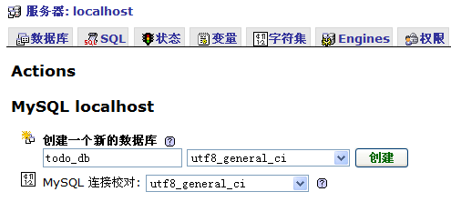
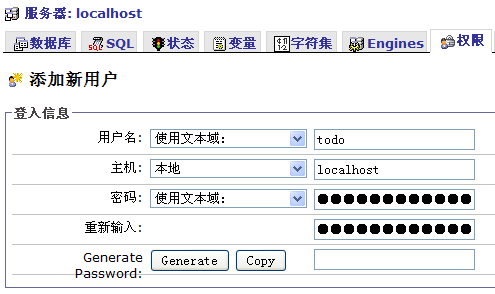
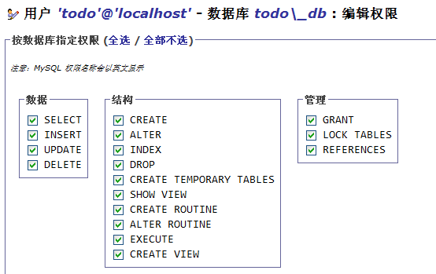

# 创建数据库

在开始开发前，我们要准备好数据库。

通过 phpMyAdmin 或其他 MySQL 管理工具，创建一个名为 todo_db 的数据库。并且建立名为 todo 的数据库帐号，然后设置该账户的密码和对 todo_db 的访问权限。

*注意在创建数据库时，一定要把字符集选择为“utf8_general_ci”，否则可能出现乱码问题。*

进行完毕上述工作后，我们将修改 configs/database.yaml 文件，以便应用程序能够成功连接到数据库。不过在此之前还需要简单学习一下与 YAML 有关的知识。

