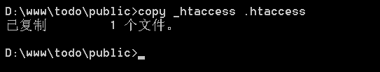
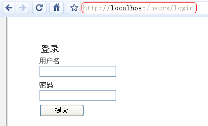

# 启用 URL 路由
要启用 URL 路由，要求服务器必须支持 URL 重写或 PATHINFO 路径变量。前者在 apache、lighttpd、nginx、IIS 等 Web 服务器环境中都可以支持，后者则支持更多的服务器环境。

## 配置服务器环境
找到apache服务器配置文件 httpd.conf，找到如下代码添加注释部分，或者覆盖：

```
<VirtualHost *>
    DocumentRoot "d:/www"
    ServerName 127.0.0.1
 
    <Directory "d:/www">
        Options Indexes FollowSymLinks
        IndexOptions FancyIndexing FoldersFirst NameWidth=* VersionSort XHTML
 
        #开启rewrite 路由重写
        AllowOverride All
 
        Order allow,deny
        Allow from all
    </Directory>
</VirtualHost>
```

再查找：

```
#LoadModule rewrite_module modules/mod_rewrite.so
```
改为：

```
LoadModule rewrite_module modules/mod_rewrite.so
```

最后一步，将 d:/www/todo 目录中的 _htaccess 改名或复制为 .htaccess。这个操作必须在命令行窗口中进行：



QeePHP 虽然也需要 .htaccess，但改变 URL 样式却不需要修改这个文件。而且 QeePHP 附带的 .htaccess 也只有区区舒航代码：

```
RewriteEngine on
 
RewriteCond %{SCRIPT_FILENAME} !-f
RewriteCond %{SCRIPT_FILENAME} !-d
RewriteRule ^(.*)$ index.php/$1
```

## 修改应用程序设置
修改 configs/environments.yaml 文件，找到：

```
# url 参数的传递模式，可以是标准、PATHINFO、URL 重写等模式，
# 分别对应 standard、pathinfo、rewrite 设置值
dispatcher_url_mode: standard
```
改为：

```
dispatcher_url_mode: rewrite
```

然后重启 Apache 服务器,再通过浏览器访问 http://localhost/todo/public/ 应该看到 todo 应用的页面。如果出错，请仔细核对上述步骤。




仔细观察上图中地址栏的中地址，就会发现 URL 已经变成了 http://localhost/todo/public/users/login。而这种改变没有修改一行代码！


