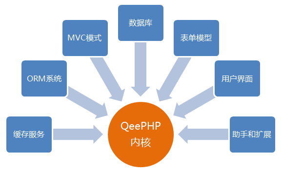

# QeePHP
QeePHP 是一个与众不同的框架。

QeePHP 遵循“内核最小化，功能插件化”的原则，利用微内核实现了一个快速、可扩展的架构。然后在核心之外，通过各种插件提供不同类型的基础服务。

这种架构模式的优势：

* 微内核保证了性能，不会因为将各种功能添加到内核中导致框架出现性能问题
* 具有优秀的可扩展能力和灵活性，而且外围功能的发展不会影响到框架核心
* 由于各种功能都是插件，开发者可以按照应用程序的需求来选择不同的功能组合
* 由于核心和外围功能是分离的，框架和应用程序的稳定性和可靠性都能得到保证，不会因为某个功能的问题影响到整个框架和应用

这种架构唯一的劣势可以说是传统保守思想的阻力，就像还有不少 PHP 开发者认为框架不值得使用一样。

采用“微内核+扩展”架构的 PHP 框架虽然目前只有 QeePHP 一个。但在 PHP 之外的世界中，这种架构模式早已成为发展方向。

Linux 就是最典型的案例，其“内核+扩展功能”的架构为无数的 Linux 发行版奠定了基础。并且让 Linux 可以顺畅运行在各种硬件环境中，这在传统架构软件中是不可想象的。因此即便是 Windows 7 也顺应发展趋势，采用微内核技术。

而在 Web 应用开发框架中，Java 世界早就普及了多层分离的架构模式。以快速开发引领 Web 世界革命的 Ruby on Rails 框架也将在第三版和 Merb 进行合并，合并后也是“微内核+扩展”的架构模式。这不但证明了这种架构模式的可行性，也是说明这种架构模式是未来的发展方向。我们相信 QeePHP 的架构模式会经受住时间和用户的考验，证明其具备出色的性能、可靠性和扩展能力。

