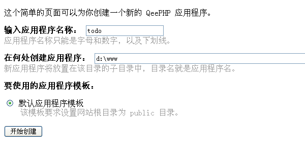
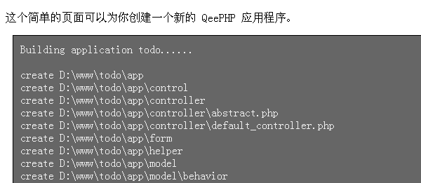
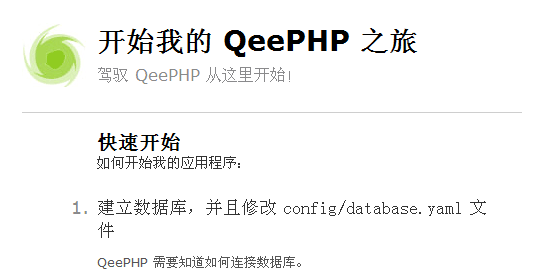

# 创建应用程序
QeePHP 提供了基于 Web 和命令行的工具来创建一个新的 Web 应用程序。这里我们将一直使用基于 Web 界面的工具，有关命令行工具的使用请参考开发指南中的相关章节。

用浏览器访问 http://localhost/qeephp/scripts/web_chili.php ，将可以看到用于创建新应用程序的界面。

输入应用程序名称和应用程序所在目录，点击“开始创建”按钮即可新建一个应用程序。

现在一个名为 todo 的应用程序就出现在 d:\wamp64\www\todo 目录中了。

打开浏览器，输入地址：http://localhost/todo/public 可以看到应用程序的欢迎页面。

就这样，一个全新的 QeePHP 应用已经准备完成！

