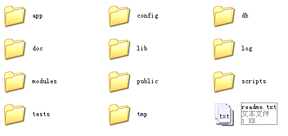
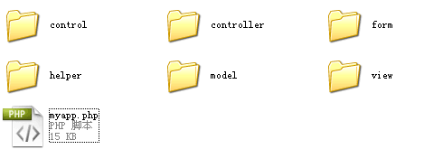

# 目录结构
刚刚新建好的应用程序具有如下的目录结构：

> 如果创建应用程序时选择了不同的应用程序模板，那么目录结构看上去会有所不同。

## 顶层目录结构
应用程序顶层目录较多，每个目录的详细说明：

* app
保存应用程序主要代码的目录，包括控制器、模型、视图、表单、用户界面控件、助手等。

* config
保存应用程序的所有配置文件。

* db
保存应用程序的数据库脚本文件，通常是一些 .sql 文件。

* doc
保存应用程序的文档。

* lib
保存应用程序用到的第三方库文件，例如 Swift 邮件库。

* log
保存应用程序运行期间产生的日志文件。

* modules
保存应用程序的功能模块。每一个功能模块都有自己的控制器、模型等，相当于一个子应用程序。

* public
保存应用程序的入口文件，以及能够被浏览器访问的文件。部署时应该将网站根目录指向该目录。

* scripts
保存应用程序开发和维护时用到的脚本文件，WebSetup 的入口文件也在这个目录中。

* tests
保存应用程序的测试代码。

* tmp
保存应用程序运行时产生的临时文件。

## app 子目录
上述目录中，app 目录中的子目录需要详细说明：

**controller**
这个目录保存了控制器的代码。每一个控制器文件的命名方式都是“控制器名_controller.php”，文件名一律全小写。例如 posts 控制器的对应文件是 controller/posts_controller.php。
>事实上，QeePHP 的所有文件都是全小写文件名，这可以避免在 Linux/Unix 服务器上出现文件名大小写导致的错误。QeePHP 应用程序除了第三方库文件，其他文件也全部是小写文件名。

**model**

模型代码所在目录，model/behavior/ 目录中是模型的行为插件代码。模型文件的命名方式是“模型类名称.php“，文件名同样是全小写。

要注意的是如果模型类名称中包含下划线“_”，那么应该在 model 下建立相应的子目录来存储。例如模型的类名称是“Forum_Thread“，那么这个模型的文件名应该是 forum/thread.php。其完整路径就是 /app/model/forum/thread.php。

有关类名称和目录结构及文件名的关系，请参考开发指南相关章节。

**view**

应用程序视图文件所在目录。视图文件目录下有两个特殊目录： _elements 和 _layouts。分别用于存储视图片段文件和布局视图文件。有关这两个目录中文件的命名规则会在教程后续部分用到时说明。

除了两个特殊目录，视图目录下会有与每一个控制器同名的子目录。例如 posts 控制器对应的视图目录就是 view/posts/，该目录中的文件名则和控制器动作的名称一致。
>控制器动作的解释请继续阅读本教程，会在 MVC 模式章节进行说明。

**form**

由于惯例上，QeePHP 应用中所有表单对象的类名称都是以 “Form_”开头，所以表单对象的文件都存储在该目录中。假设表单对象的名称是 Form_UserInfo，那么对应的文件就是 form/userinfo.php。

大部分表单还有自己的配置文件。配置文件和表单对象文件放置在一起，通常命名为“表单文件名_form.yaml”。例如 Form_UserInfo 表单的配置文件就是 form/userinfo_form.yaml。
>但是QeePHP得表单模块我们觉得对于配置过于复杂，对于复杂的表单逻辑显得很无力，所以我们决定不使用它的表单模块功能。

**control**

用户界面控件是 QeePHP 中实现用户界面组件化的强大工具。大部分应用程序都会创建自己的用户界面控件。由于用户界面控件的类名称都是“Control_”开头，所以控件的代码都存储在该目录中。

如果控件名称是“Control_LatestPosts”，则对应文件是 control/latestposts.php。除了控件代码，控件的视图也可以存储在该目录中，通常命名为 control/latestposts_view.php。

**helper**

应用程序自己的助手类可以放在该目录中。类名称为“Helper_Text”的助手对应文件是 helper/text.php。

