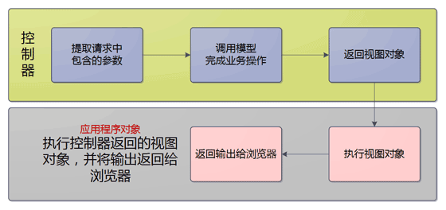

# 控制器
控制器在 MVC 模式中充当了模型和视图的桥梁。控制器负责处理请求，并调用模型完成业务操作，最后返回适当的视图对象。而应用程序对象则执行视图对象来构造输出内容，并将输出内容返回给浏览器。


## 控制器和动作方法
通常，我们的应用程序会提供一系列的 URL 地址给用户。通过访问这些 URL 地址就可以使用应用程序的不同功能。例如“create.php”表示创建，而“edit.php”表示修改。由于 QeePHP 采用了 MVC 模式，所以我们不需要为每一个功能都编写一个单独的 PHP 文件。我们可以把一组相关的功能放到一个控制器中，而控制器的每一个动作方法就是一项独立的功能。

由于整个应用程序的所有功能都是通过入口文件来访问的。这要求我们通过不同的 URL 参数来指定要访问的控制器及动作方法。这样应用程序对象通过检查 URL 中的参数，就可以确定用户想调用的控制器和动作方法。
## 通过 URL 参数指定控制器和动作

我们来做个测试，修改 app/controller/default_controller.php 文件，加入：


```php
function actionTest()
{
    echo "OK, default 控制器的 test 动作被调用。";
}
```
然后通过浏览器访问 http://localhost/todo/public/index.php?controller=default&action=test ，即可看到我们在 actionTest() 动作方法中写入的文字。


在上面的例子中，如果注意到 URL 地址中包含的“controller=default&action=test”就会明白通过名为“controller”和“action”的参数，可以指定我们要调用的控制器和动作方法。

依此类推，http://localhost/todo/public/index.php?**controller=users&action=create** 这个 URL 指定了要访问 users 控制器的 create 动作方法。


## 动作方法
前面反复提到的动作方法是我们在控制器类中添加的特定方法。这些方法的名称都是以“action”开头，例如 actionTest()、actionIndex() 等。之所以要求必须以“action”开头，是为了避免用户从浏览器访问到控制器中不希望被外部访问的一些方法。

有一个特别的动作方法 actionIndex() 是控制器的默认动作。假如我们没有在 URL 参数中指定要调用的动作方法，那么就会调用控制器的 actionIndex() 动作方法。同理，如果没有在 URL 参数中指定要调用的控制器，就会调用 default 这个默认控制器。


## 美化 URL
可能读者朋友觉得上面的 URL 又臭又长，看上去难看，而且影响 SEO。不过没关系，QeePHP 的 URL 路由器可以让我们构造任意形式的 URL，这里举例使用的 URL 样式是默认样式。有关美化 URL 的内容会在本教程的后续部分说明。

>默认 URL 样式虽然不美观，但是兼容任何服务器环境。当服务器运行环境不支持 URL 路由器时，我们可以使用默认样式来保证应用程序可以正常工作。

## 总结
总结一下：

* **控制器**
控制器是一个类，定义在 controller/ 目录中。文件名是“控制器名称_controller.php”，例如 default_controller.php。

* **控制器名称**
控制器名称只能是 26 个字母和 10 个数字组成，并且不区分大小写。

* **动作方法**
动作方法是控制器类中以“action”开头的方法，例如 actionTest()。

* **动作名称**
只能是 26 个字母和 10 个数字组成，并且不区分大小写。

* **指定要调用的控制器和动作方法**
URL 参数 controller 和 action 分别用于指定要调用的控制器和动作方法。

* **默认动作方法**
未在 URL 参数中指定要调用的动作方法时，将会调用控制器的 actionIndex() 动作方法。

* **默认控制器**
未在 URL 参数中指定要调用的控制器时，将会调用 default 这个默认控制器。

