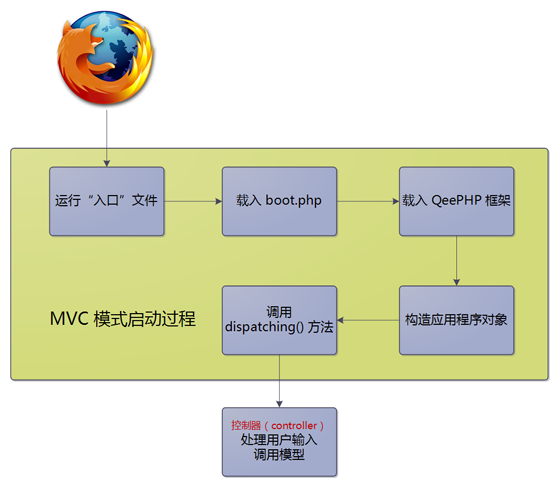
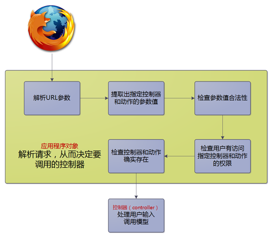

# MVC模式的启动
在 QeePHP 应用中，启动 MVC 模式需要经过一系列的操作，了解这个过程可以帮助我们更好的使用 QeePHP。

QeePHP 启动 MVC 模式的主要步骤：


*下面根据上图依次说明各个步骤载入的文件，以及文件的用途和主要功能。*

## 入口文件
首先，所有的请求都会发送到一个特殊的 PHP 脚本文件。这个文件被称为“入口”。新建好的应用程序在 public 目录中有一个名为 index.php 的文件，这个文件就是“入口”。

“入口”的代码很少：

```php
// 获得应用程序启动信息
$app_config = require(dirname(__FILE__) . '/../config/boot.php');
 
// 根据启动信息中的设置载入 QeePHP 框架和应用程序对象
require $app_config['QEEPHP_DIR'] . '/library/q.php';
require $app_config['APP_DIR'] . '/myapp.php';
 
// 构造应用程序对象，并启动 MVC 模式
echo MyApp::instance($app_config)->dispatching();
```
*这个文件要做的事情就和代码中的注释一样，非常简单。*


## boot.php
入口载入的 boot.php 是一个非常重要的文件。

这个文件返回一个包含启动应用程序必须信息的数组，主要的返回内容包括：

* **QEEPHP_DIR**
QeePHP 框架所在的目录。由于入口文件需要依赖该信息来正确载入 QeePHP 框架，所以这个设置一定不能搞错。如果已经将 QeePHP 框架所在目录加入了 php.ini 的 include_path 设置中，可以参考本教程后续的内容进行修改。

* **APPID**
标识应用程序的唯一 ID。每一个 QeePHP 应用程序都应该具有唯一的 ID。这个 ID 会被用于各种用途，包括生成缓存 ID、SESSION ID，以及 WebSetup 对应用程序的管理。APPID 只能使用字母和数字，并且不区分大小写。

* **RUN_MODE**
指定应用程序的运行模式。QeePHP 内置了三种运行：devel（开发阶段）、deploy（部署到生产环境）、test（自动化测试状态）。不同的运行模式会让框架采用不同的策略，对性能、安全性、调试信息输出等都有影响。具体信息请参考开发指南。

* **ROOT_DIR、APP_DIR、CONFIG_DIR、MODULE_DIR**
指定应用程序的各项目录，通常 boot.php 会自动设置这些选项，不需要手动指定。

* **CONFIG_CACHE_BACKEND、CONFIG_CACHED、CONFIG_CACHE_SETTINGS**
指定应用程序要使用的配置文件缓存服务，以及缓存设置。本教程里面不会用到这些设置，可以参考开发指南来修改这些设置的内容。

 boot.php 保存有对正常运行应用程序至关重要的信息，因此在确切搞懂上述设置之前，不要随意修改 boot.php 文件。有关 boot.php 的详细说明请参考开发指南的相关章节。


## 应用程序对象
在前面的 index.php 入口文件中，通过 MyApp::instance() 这样的调用构造了一个 MyApp 类的对象实例。这个对象就是应用程序对象，定义在 app/myapp.php 文件中。

应用程序对象封装了整个应用程序需要的一些公共服务，例如检查当前访问用户的身份、检查访问权限等等。

主要功能：

* 初始化应用程序运行环境
* 载入配置文件
* 设置异常处理函数
* 根据设置启动 session
* 解析请求，决定要调用的控制器

应用程序对象提供的基础服务：

* 取得当前访问用户的信息（需要启动 session）
* 将指定的用户信息保存到 session
* 从 session 清除用户信息
* 获得应用程序的设置
* 处理控制器或动作无法找到的异常情况
* 处理用户没有权限访问控制器的异常情况

> 在大部分 PHP 框架中，上述服务都被放到了框架中，但这是一种相当错误的做法。

>虽然应用程序对象的功能几乎每一个应用都需要，但是许多应用在具体要求上都有区别。如果这些功能被放在框架中，框架设计者不得不留出接口来让开发者处理额外的情况，这不但会导致框架变得复杂臃肿，还增加了开发者的定制难度。而 QeePHP 将应用程序对象完全开放给开发者，让开发者可以按照自己的需求 100% 的定制。这种做法既避免了框架变得复杂，又降低了开发者的定制难度。

应用程序对象构造后，调用了该对象的 dispatching() 方法。这个方法内容按照如下的流程真正启动 MVC 模式：


当控制器被调用时，MVC 模式就完成了启动工作，接下来就是控制器和视图的交互，以及将操作结果返回给浏览器。


