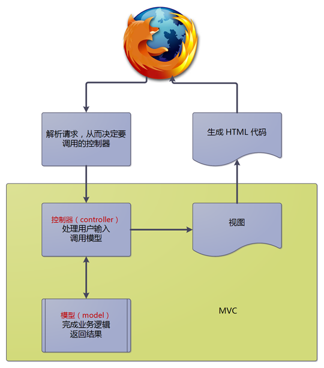

# MVC 模式
QeePHP 可以工作在命令行、Web 服务器等各种环境中。在 Web 服务器中，QeePHP 可以选择 MVC 功能组件来实现全功能的应用程序。

MVC 实际上是一系列略有不同的模式。QeePHP 采用的是Passive（被动）MVC 模式 。

在 Passive MVC 模式中，Model（模型）完全不知道自己身处于 MVC 结构之中。换句话说，Model 就是一个普通的对象，与 MVC 模式里面的其他组成部分完全没有关联。具体而言，MVC 模式涉及到下列三类对象：

* **M** 代表 Model，即模型，用于封装与业务逻辑有关的代码和数据。例如对订单模型、商品模型分别封装对订单和商品的数据和业务逻辑。

* **V** 代表 View，即视图，用于呈现内容给用户（也就是将程序运行的结果返回给浏览器显示）。例如商品列表页面、后台登录页面。

* **C** 代表 Controller，即控制器，用于接收用户输入（通过浏览器发起的请求），然后调用模型（Model）对输入数据进行处理并获得处理结果。最后将结果传递到视图（View），从而让用户能够看到自己操作的结果。例如用户点击删除文章按钮后，控制器调用操作文章的模型，删除掉指定文章，最后通过视图显示成功删除文章的提示信息。

MVC 模式最大的作用就是分离逻辑和表现。一个业务逻辑在模型中实现，而处理结果在视图中呈现。控制器则充当中间人，根据用户请求调用模型，然后把处理结果传递给视图。

这种分离有许多好处：

* 清晰的将应用程序分隔为独立的部分；
* 业务逻辑代码能够很方便的在多处重复使用；
* 方便开发人员分工协作；
* 可以方便开发人员对应用程序各个部分的代码进行测试。

QeePHP 应用程序中，MVC 模式的调用流程如下图：

## 控制器的角色
控制器在 QeePHP 应用中，充当“银行柜台营业员”的角色。所有来自用户（通常是浏览器）的请求在 QeePHP 进行解析后，都交给控制器处理。这和客户到银行办理业务总是到服务窗口前找营业员一样。

但是，控制器并不完成具体的业务。控制器仅仅是检查用户请求的有效性（输入数据是否合法有效），然后调用模型的业务方法来实际完成业务。这和银行营业员办理业务时通过电脑处理单据一样，营业员仅仅是检查用户提供的资料是否有效。

控制器调用模型获得处理结果后，将结果存入视图。视图则将结果转换为 HTML 代码，并由 QeePHP 返回给浏览器。浏览器解析获得的 HTML 代码，最终将处理结果显示给用户。

图“MVC 模式的调用流程”描述了 QeePHP 中 MVC 模式的大概工作流程。流程中可以看出控制器充当的角色，以及需要完成的任务。从某种意义上说，控制器是应用程序暴露给外部的接口。应用程序外部的用户，只有通过访问控制器才能够使用应用程序，而不是直接访问到应用程序的模型等内在部分。

