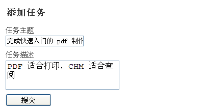
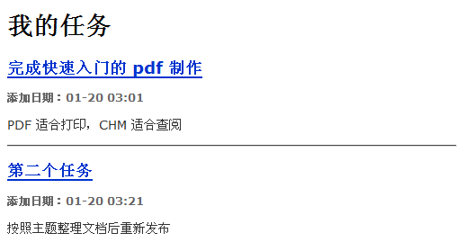

# 添加任务
添加任务的功能实现和前面实现用户功能的流程完全一致：

1. 根据需求完善模型
2. 创建需要的表单
3. 编写控制器代码
 
## 完善 task 模型
打开 app/model/task.php（如果没有则用 WebSetup 创建），修改下面几个地方：

属性和关联的定义：

```php
'props' => array
(
    .....
 
    'is_completed' => array('readonly' => true),
    'completed_at' => array('readonly' => true),
    'owner' => array(QDB::BELONGS_TO => 'User', 'source_key' => 'owner_id'),
),
```

验证规则:

```php
'validations' => array
(
    'subject' => array
    (
        array('not_empty', '任务主题不能为空'),
        array('max_length', 180, '任务主题不能超过 60 个汉字或 180 个字符'),
    ),
),
```

自动填充规则：

```php
'create_autofill' => array
(
    .....
 
    // 新建任务的 is_completed 状态总是为 false
    'is_completed' => false,
    // 新建任务的 completed_at 值总是为 null
    'completed_at' => null,
),
```
create_autofill 设置可以在创建对象时将指定的数值设置为特定值。例如“新建任务的状态是未完成”这个逻辑就可以通过简单的指定 create_autofill 来实现。
最后再加上安全性设置：

```php
'attr_accessible' => 'subject, description',
```

attr_accessible 设置会在构造对象时产生作用：

```php
$task = new Task($form->values());
$task->save();
```

上述代码构造了一个新的 task 模型实例，并且以表单的值作为对象初始值。这种方式很方便，但存在一个安全隐患。

假设用户在客户端构造一个包含“task_id”字段值的表单，并提交到服务器，那么此时构造出来的 $task 对象就包含了 task_id 属性值。由于 task_id 属性也是 task 对象存储在 tasks 表中的主键字段，那么在接下来调用 save() 方法时，**实际完成的操作不是“新建一个 task 对象”，而是“更新一个已有的 task 对象”。因此我们务必要堵上这样的漏洞。**

**设置 attr_accessible 选项，可以指定哪些属性可以通过构造函数来赋值**，这样上面的代码中即便表单包含 task_id 值，也不会被存入新建的对象，实现了安全性。

## 创建表单

添加 app/form/task.php 内容是：

```php
class Form_Task extends QForm
{   
    function __construct()
    {
        
        // 调用父类的构造函数
        parent::__construct('form_task');
        
        //也可以直接定义配置数组
        $fields = array('subject'=> array(),'description' => array(), 'is_completed' => array());
        $this->loadFromConfig($fields);
        //导入Task表的属性验证规则
        $this->addValidations(Task::meta());
    }
}
```

## 添加控制器动作

修改 tasks 控制器（如果没有则通过 WebSetup 创建），添加 actionCreate() 动作方法：

```php
function actionCreate()
{
    $form = new Form_Task();
 
    if ($this->_context->isPOST() && $form->validate($_POST))
    {
        // 通过应用程序对象获得当前用户对象
        $user = $this->_app->currentUserObject();
 
        // 通过用户对象创建任务
        $task = $user->createTask($form['subject']->value, $form['description']->value);
 
        // 保存并重定向浏览器
        $task->save();
        return $this->_redirect(url('tasks/index'));
    }
 
    $this->_view['form'] = $form;
}
```

以及对应的视图 app/view/tasks/create.php：


```html
<?php $this->_extends('_layouts/default_layout'); ?>
  
<!-- // 定义一个名为 contents 的区块 -->
<?php $this->_block('contents'); ?>

<form action="<?php echo url('tasks/create'); ?>" method="post">
 <h1>添加任务</h1>
  <fieldset>
    <p>
      <label for="username">任务主题</label>
      <input type="text" name="subject" id="subject" />
      <span class="error"><?php echo $form['subject']->isValid() ? "" :  $form['subject']->errorMsg()[0];?></span>
    </p>
    
    <p>
      <label for="password">任务描述</label>
      <textarea name="description" id="description" rows="5"  ></textarea>
      <span class="error"><?php echo $form['description']->isValid() ? "" :  $form['description']->errorMsg()[0];?></span>
    </p>
    
    <p> 
      <label> </label>
      <input type="submit" name="Submit" value="添加" />
    </p>
  </fieldset>
</form>

<?php $this->_endblock(); ?>
```

这里我们用到了应用程序对象的一个新方法 currentUserObject()。但这个方法还需要添加到 app/myapp.php 中，代码如下：

```php
/**
 * 获得当前用户对应的 User 模型对象实例
 *
 * @return User
 */
function currentUserObject()
{
   $key = 'currentUserObj';
   
   try{
       //先检查是否有缓存（缓存只在当前访问链接期间有效）
       $user = Q::registry($key);
       return $user;
   }catch (QException $e){   
   }
   
   $data = $this->currentUser();
   $user = User::find('user_id = ?', $data['id'])->query();
   if ($user->id())
   {
       //写入缓存(实际就是内存缓存)
       Q::register($user, $key);
       return $user;
   }
   else
   {
       throw new MyAppException('当前访问用户没有对应的 User 对象');
   }
}
```


currentUserObject() 方法不但通过查询操作获得 User 模型对象实例，而且通过检查其 ID 来确保这个对象是肯定存在的。这种做法从根本上保证了后续数据的有效性。为了避免每次获取都去查询数据库，通过 `Q::register($user, $key)`写入内存缓存，查询数据库前先通过`Q::registry($key)`取出缓存。


>保证逻辑的正确性和数据的有效性是应用程序的核心使命！

## 测试创建任务
通过浏览器访问 <http://localhost/todo/public/index.php?controller=tasks&action=create> 就可以看到添加任务表单：



输入有效数据后提交，可以通过 phpMyAdmin 看到数据已经成功添加：


## 添加任务查看页面
修改 tasks 控制器的 actionIndex() 动作方法：


```php
function actionIndex()
{
    $tasks = Task::find('owner_id = ?', $this->_app->currentUserObject()->id())->getAll();
    $this->_view['tasks'] = $tasks;
}
```

以及对应的视图 app/view/tasks/index.php：

```php
<?php $this->_extends('_layouts/default_layout'); ?>
 
<?php $this->_block('contents'); ?>
 
<div class="tasks">
 
  <h1>我的任务</h1>
 
  <?php foreach ($tasks as $task): ?>
 
  <h2><a href="<?php echo url('tasks/edit', array('task_id' => $task->id())); ?>"><?php echo h($task->subject); ?></a></h2>
 
  <p class="meta">
    <?php if ($task->is_completed): ?>
    <em>已经在 <?php echo date('m-d H:i', $task->completed_at); ?> 完成该任务</em>
    <?php else: ?>
    <strong>添加日期：<?php echo date('m-d H:i', $task->created); ?></strong>
    <?php endif; ?>
  </p>
 
  <?php if ($task->description): ?>
  <p class="description">
    <?php echo nl2br(h($task->description)); ?>
  </p>
  <?php endif; ?>
 
  <hr />
 
  <?php endforeach; ?>
 
</div>
 
<?php $this->_endblock(); ?>
```

最后在 app/public/css/style.css 添加一些样式定义，以便让列表页面看上去更美观：


```css
.tasks h2 {
        font-size: 18px;
        font-weight: bold;
}
 
.tasks p {
        font-size: 14px;
        color: #333;
        font-weight: normal;
}
 
.tasks p.meta {
        font-size: 12px;
        font-weight: normal;
        color: #666;
}
```

现在添加任务后就可以看到任务列表了：




现在我们在顶部加上一个连接，跳转到添加任务的页面

```html
<a href="<?php echo url('tasks/create') ?>">添加任务</a>
```

