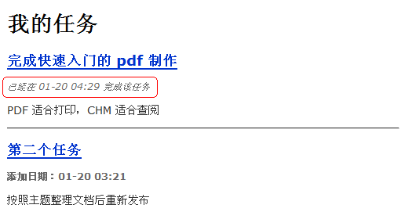
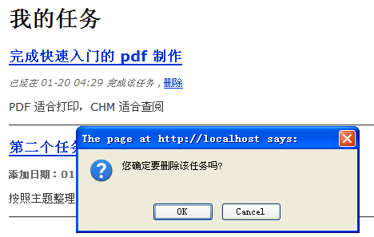

# 修改和删除任务
修改工作非常简单，在 tasks 控制器中添加如下代码即可：

```php
function actionEdit()
{
    // 查询指定 ID，并且其所有者是当前用户的任务（禁止修改他人的任务）
    // [owner.user_id] 加上中括号表示内联owner表，否者owner.user_id只会作为task的字段构造sql，将会报错
    $task = Task::find('task_id = ? AND [owner.user_id] = ?',
        $this->_context->task_id,
        $this->_app->currentUserObject()->id())->query();
 
    if (!$task->id())
    {
        // 如果任务的 ID 无效，视图修改的任务不存在或者不是当前用户创建的
        return $this->_redirect(url('tasks/index'));
    }
 
    // 构造表单对象
    $form = new Form_Task();
    
    if ($this->_context->isPOST() && $form->validate($_POST))
    {
        // changeProps() 方法可以批量修改 task 对象的属性，但不会修改只读属性的值
        $task->changeProps($form->values());
        // 根据是否选中“已完成”检查框来设置任务的状态
        $task->completed($form['is_completed']->value);
 
        // 保存并重定向浏览器
        $task->save();
       return $this->_redirect(url('tasks/index'));
    }
    
    $this->_view['task'] = $task;
    $this->_view['form'] = $form;
    // 重用 create 动作的视图
    $this->_viewname = 'create';
}
```

这个方法完成下列工作：

1. 首先根据指定的 task_id 和当前用户ID查询任务对象，如果失败则重定向浏览器。这可以有效阻止用户尝试编辑不属于自己的任务。
2. 如果是 POST 提交，并且表单通过了验证，则更新任务信息，并且根据是否选中了“已完成”检查框来修改任务状态。最后保存修改并重定向浏览器。
3. 不是 POST 提交，则将任务对象数据导入表单，以便在表单中显示要编辑的内容。

上述代码中，之所以修改任务状态必须调用 completed() 方法，是为了因为 task 模型的 is_completed 属性非常重要，不应该“无意”中被修改。明确的 completed() 方法调用就可以避免此问题。而且当任务状态改变为“已完成”时，还需要设置任务的 completed_at 属性，以记录任务完成的时刻，completed() 方法可以同时完成这项修改。

所以我们还要在 task 模型中添加 completed() 方法：


```php
/**
 * 明确修改任务的状态
 *
 * @param boolean $completed
 *
 * @return Task
 */
function completed($completed)
{
    $completed = (bool)$completed;
    if ($completed && !$this->is_completed)
    {
        // 如果任务状态从“未完成”变成“已完成”，则保存完成任务的时刻
        // changePropForce() 可以强制改变一个只读属性的值
        $this->changePropForce('completed_at', time());
    }
    elseif (!$completed)
    {
        // 如果任务状态设置为“未完成”，则清理掉 completed_at 记录的时间
        $this->changePropForce('completed_at', null);
    }
    $this->changePropForce('is_completed', $completed);
    return $this;
}
```

相比传统的做法，面向对象的方式在初期会需要更多的代码。但是这些代码保证了逻辑的严密性和数据的有效性，应用软件规模越大，这种做法带来的好处就越多。而且随着应用规模的逐渐增长，面向对象充分重用逻辑与代码的优势就会体现出来，最终可以获得一个更健壮、内部更整洁的系统。

实际运行效果：



## 删除任务
删除任务功能非常简单：

```php
function actionDelete()
{
    // destroyWhere() 方法的参数和 find() 方法完全一致
    Task::meta()->destroyWhere('task_id = ? AND [owner.user_id] = ?',
        $this->_context->task_id,
        $this->_app->currentUserObject()->id());
 
    return $this->_redirectMessage(
        '删除成功',
        '您已经成功删除了一个任务',
        url('tasks/index'));
}
```

修改一下 app/tasks/index.php 视图，将删除任务的连接加进去：


```html
<p class="meta">
  <?php if ($task->is_completed): ?>
  <em>已经在 <?php echo date('m-d H:i', $task->completed_at); ?> 完成该任务</em>
  <?php else: ?>
  <strong>添加日期：<?php echo date('m-d H:i', $task->created); ?></strong>
  <?php endif; ?>
  , <a href="<?php echo url('tasks/delete', array('task_id' => $task->id())); ?>" onclick="return confirm('您确定要删除该任务吗?');">删除</a>
</p>
```

运行效果：




