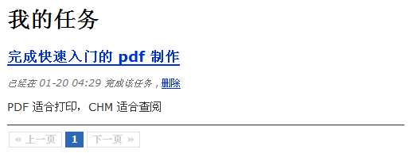

# 分页与最后的完善
随着我们往应用程序中添加了越来越多的任务，分页显示就势在必行了。QeePHP 对分页有各种内置的方法，而且可以使用现成的分页导航插件来减少工作量。

## 学会偷懒
>当你需要往应用程序中添加一个新功能时，请首先查看 <https://github.com/jackLucky/qeephpExtend>，也许惊喜就在等着你。

这里我们使用 <https://github.com/jackLucky/qeephpExtend/tree/master/control/pagination> 这个分页导航插件。按照这个控件的说明把控件文件和样式表加入到应用程序中后，修改 tasks 控制器的 actionIndex() 方法为：


```php
   // 分页查询
    $page = intval($this->_context->page);
    if ($page < 1) $page = 1;
 
    // 构造查询对象
    $select = Task::find('owner_id = ?', $this->_app->currentUserObject()->id());
    $select->limitPage($page, 5);
 
    // 将分页信息和查询到的数据传递到视图
    $this->_view['pagination'] = $select->getPagination();
    $this->_view['tasks']      = $select->getAll();
```


最后修改 app/view/tasks/index.php 视图，在最后一行“”前加入：

```php
<?php $this->_control('pagination', 'my-pagination', array('pagination' => $pagination)); ?>
```





## 修改默认控制器
当前，查看任务列表需要我们在 URL 中明确指定访问 tasks 控制器，这显然很不友好。所以我们对默认的 default 控制器做一点小手术，

修改 app/controller/default_controller.php 文件的内容为：


```php
class Controller_Default extends Controller_Abstract
{
    function actionIndex()
    {
        if ($this->_app->currentUserRoles())
        {
            // 如果已经登录，就转到任务列表页面
            return $this->_redirect(url('tasks/index'));
        }
        else
        {
            // 未登录则转到登录页面
            return $this->_redirect(url('users/login'));
        }
    }
}
```

修改后，todo 应用的功能就算齐备了。

