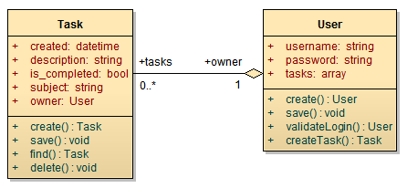

# 需求分析
需求分析的主要工作就是分析用户想要实现的功能，找出可行的解决方案，并且整理为下一步开发工作需要的资料。在领域驱动开发过程中，需求分析实际上就是找出领域中存在的模型，并且确定这些模型的职责。

虽然从领域中提取模型的方法很多，但大多数时候，使用用况分析是比较简单的办法。用况分析可以确定领域中的参与者以及这些参与者要完成的任务，从而找出领域中存在的模型。

>用况图很容易理解，人形图标表示使用者。使用者可能是人类，也可能是其他程序（例如一个功能模块）。而每一个椭圆，代表软件系统中的一种功能，而人形图标和椭圆之间的连接线表示使用者会用到该功能。

还是回到我们将要创建的 todo 应用。从上图可以看出，todo 应用中，存在“用户”和“任务”两个“名词”。这两个名词暗示了系统中应该存在与之对应的模型。

通过分析用况，可以很容易的找出领域中的“用户”和“任务”两个模型。

## 确定模型的属性

根据进一步的分析和以往经验，我们可以初步确定“用户”和“任务”这两个模型应该具备的属性：

**模型 user 的属性**:

| 字段名 | 说明 |
| --- | --- |
| username | 用户名 |
| password | 密码 |

**模型 task 的属性**:

| 字段名 | 说明 |
| --- | --- |
| subject | 任务的主题 |
| description | 任务的描述 |
| is_completed | 指示任务是否已经完成 |
| created | 任务添加的日期 |

将表格转换为类图，可以更直观的表现类的概貌。

有了类的基本概貌，我们再来标明两个模型之间的关系。

因为“任务”必然是属于某一个“用户”的，所以我们为 Task 类添加一个 owner 属性，用于指示该“任务”所属的“用户”。而 User 类则添加一个 tasks 属性，用于包含该“用户”创建的所有“任务”。

进行到这里，“任务”对象和“用户”对象之间的关联就要跃然纸上了。

## 确定模型间的关系
对象间的关系有三种最重要的关系：依赖、关联和泛化。

依赖是使用关系。例如“台灯”依赖“灯泡”来发光。
关联是对象间的结构关系。例如“用户”与一组“任务”相关。
泛化是对象间的继承。例如“VIP 用户”类是“用户”类的继承类。

在 todo 应用中，只存在“关联”一种关系。但是“任务”和“用户”在关联的两端并不是处于同一层次。由于“任务”不可能单独存在，必然是属于某一个“用户”的。因此两者的关联是“用户”聚合了“任务”，在该关联关系中，“任务”属于从属地位。

对象在关联关系中的位置和地位，决定了如何为关联关系进行建模。后续的章节中，我们将用代码将关联关系以及关系本身的特点体现出来。

## 确定模型的行为
确定了模型的属性和模型间的关系，我们还需要确定模型的行为。这就需要通过分解业务逻辑来明确模型在逻辑中的行为。

例如“创建任务”这个逻辑，要求用户输入任务主题、描述（可选），然后创建一个“任务”模型对象实例并保存起来。因此这个逻辑中，“任务”模型的行为就是“创建”。而这恰好和“创建任务”这个逻辑中包含的“动词”相同。所以很大程度上，用况中包含的名词暗示了模型，而动词则暗示了模型应该具备的行为。

按照上述的简单规则，我们可以列出模型应该具备的行为：

**模型 user 的行为**:

| 行为 | 说明 |
| --- | --- |
| login | 登录 |
| logout	 | 注销 |
| createTask | 创建属于该用户的任务 |
| loadTasks	 |载入属于该用户的任务 |

**模型 task 的行为**:

| 行为 | 说明 |
| --- | --- |
| delete | 	删除任务 |

由于任务不可能脱离用户存在，所以大部分行为都集中在 user 模型中。

但是稍加分析会发现，user 模型的 login 和 logout 方法是不需要的，因为“登录”和“注销”实际上并不是业务逻辑。

“登录”是用户从系统取得使用授权的过程，整个用况分解为“提供用户界面输入用户名和密码 → 验证用户输入的用户名和密码 → 为用户提供授权”这样一组步骤。在这个系列步骤中，只有“验证用户输入的用户名和密码”属于业务逻辑，而其余两个步骤前面一个属于表现层的工作，后面一个属于应用程序基础设施的工作。同样，“注销”是清除用户从系统获得的使用授权，因此 login 和 logout 本质上与 user 模型本身其实毫无关系。

所以经过调整后，user 模型的行为如下：

**user 模型调整后的行为**:

| 行为 | 说明 |
| --- | --- |
| validateLogin | 验证用户名和密码 |
| createTask | 创建属于该用户的任务 |
| loadTasks |	载入属于该用户的任务 |

在确定模型的属性和行为时，我们就是在使用面向对象的思想来设计我们的应用程序。这个环节中，我们要找出系统中必须的模型，并搞清楚这些模型在各个逻辑中需要承担的责任。

应用程序的规模越大，花在这个环节的精力也越多。但是在这个阶段一定要避免“过度设计”这个常见的问题。

>“过度设计”通常表现为几乎无限制度的分解业务需求、创建关联关系以及类定义。过度设计不但会造成结构复杂，还很容易出现性能问题和维护困难。更重要的是在应用程序开发初期，所有对于“未来需求”的预测，越是精确就越不准确，最终只会造成浪费。

现在，我们已经为创建模型做好了准备工作。

