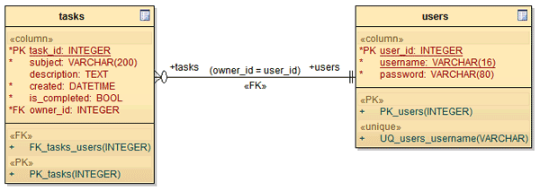

# 创建需要的模型

确定了模型的属性和行为，就可以创建模型了。

## 创建存储模型的数据表

模型在程序中都是用一个类来表现的，然后通过添加方法和属性来定义出完整的模型。但如果模型需要保存到数据库，那么数据库中就必须有保存该模型需要的数据表。

虽然没有强制要求，但大多数情况下，模型的属性和数据表的字段是一一对应的：

**user 模型属性对应的数据表字段**：

| 字段名 | 说明 |
| --- | --- |
| user_id | user_id INT | 
| username | 	username VARCHAR | 
| password	| password VARCHAR | 


**task 模型属性对应的数据表字段**：

| 字段名 | 说明 |
| --- | --- |
| task_id | task_id INT |
| subject | subject VARCHAR |
| description | description TEXT |
| created | created INT |
| is_completed	 | is_completed BOOL |


>这种一一对应可以减少许多麻烦，提高开发效率，这也是“契约式编程”概念的一部分。

注意上表中，我们为 task 和 user 模型分别添加了 task_id 和 user_id 两个属性。这两个属性会被设置为数据表的主键。主键让数据库和应用程序可以更容易更快速的查找保存的对象，因此对于绝大多数模型，我们都需要添加一个单独的主键。

## ORM 的作用
不过上表列出的字段是不完整的。因为 user 模型和 task 模型之间的关系并没有体现出来。这就是“对象与关系式数据库之间的阻抗不匹配”问题。

>对象与关系式数据库之间的阻抗不匹配问题，根源在于关系式数据库没有办法直接保存对象与对象之间的关系。例如一个用户有多个任务，在面向对象体系中就是“用户”对象聚合了多个“任务”对象，而关系式数据库不支持这样的表述方式。

>所以在关系式数据库中存储对象间的关系需要特别的方法，并且需要 ORM 系统来提供帮助。看到这里，就应该明白 ORM（Object-relational mapping —— 对象关系映射）的真正含义了。

例如“用户”和“任务”关联，而“任务”和“任务评论”关联，“任务评论”和“评论人”关联。在这些关联对象间导航应该是很自然和简单的事情：


```php
// 开始遍历用户的所有任务
// $users->tasks 是包含多个 Task 对象的集合
foreach ($user->tasks as $task)
{
    echo "任务主题：{$task->subject}\n";
 
    // 遍历任务的所有评论
    // $task->comments 是包含多个 Comment 对象的集合
    foreach ($task->comments as $comment)
    {
        echo "评论人：{$comment->author->username}\n";
    }
}
```

上述代码中，从 user 对象的 tasks 属性可以访问到聚合的 task 对象。而从 task 对象的 comments 属性又可以访问到任务的所有评论，再通过 $comment->author->username 访问评论人的用户名。

作为一个出色的 ORM，不但要能够支持多种关联关系，以及对象间的泛化和依赖，还应该让开发者可以在对象关系网间自由的导航。正是这种顺畅的对象导航，让领域驱动开发变得更加简单。开发者不需要操心如何维护对象间的关系，要做的仅仅是将对象间的关系定义出来。只要定义好关系，我们就可以通过直观的代码在对象间进行游历。

QeePHP 支持四种关联关系，分别是“一对一”、“一对多”、“多对多”和“从属”关联关系。为了便于描述，每一个关联关系的两端分别称为“来源对象”和“目标对象”，如下图：

`上图中线段的起点是来源对象，箭头所指是目标对象`

**这四种关系在关系式数据库中的表示方式分别是**：

| 关联关系  | 来源对象的外键字段  | 目标对象的外键字段 |
| --- | --- | --- | --- |
| 一对一	| 无  | 来源对象的主键 |
| 一对多 | 无 | 来源对象的主键 |
| 多对多 | 无 | 无 |
| 从属	 | 目标对象的主键 |	无 |

在上述四种关联关系中，“一对一”、“一对多”和“从属”实际上是相反的关系。而“多对多”关联关系必须依赖一个单独的数据表来存储，这个表称为“中间表”。关于“多对多”的问题，我们稍后再来阐述。

## 创建数据表和模型
根据“用户”和“任务”间的关联关系，我们需要为 task 模型的数据表添加一个 owner_id 字段，用于保存“用户”模型的主键值。最终两个数据表如下图：


上述数据表转换为 MySQL 数据库的 DDL 就是：


```sql
CREATE TABLE `tasks` (
  `task_id` int(11) NOT NULL AUTO_INCREMENT,
  `subject` varchar(200) NOT NULL,
  `description` text,
  `created` int(11) NOT NULL,
  `updated` int(11) NOT NULL,
  `is_completed` tinyint(1) NOT NULL,
  `completed_at` int(11) DEFAULT NULL,
  `owner_id` int(11) NOT NULL,
  PRIMARY KEY  (`task_id`),
  KEY `owner_id` (`owner_id`)
)
 
 
CREATE TABLE `users` (
  `user_id` int(11) NOT NULL AUTO_INCREMENT,
  `username` varchar(20) NOT NULL,
  `password` varchar(80) NOT NULL,
  PRIMARY KEY  (`user_id`),
  UNIQUE KEY `username` (`username`)
);
 
 
ALTER TABLE `tasks` ADD FOREIGN KEY (`owner_id`) REFERENCES `users` (
    `user_id`
) ON DELETE CASCADE;
```

在 phpMyAdmin 或者其他工具在数据库中执行上述 DDL 语句创建出需要的数据表后，我们就可以通过 WebSetup 来创建模型了。

分别创建好 Task 和 User 模型后，todo\app\model 目录中就可以看到 task.php 和 user.php 两个文件。虽然自动生成的模型只能算半成品，但基本功能已经可以使用了，我们将在后续开发中不断完善这些模型。

