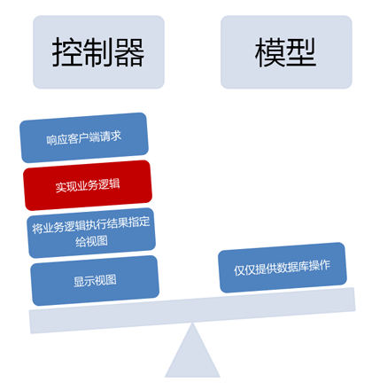
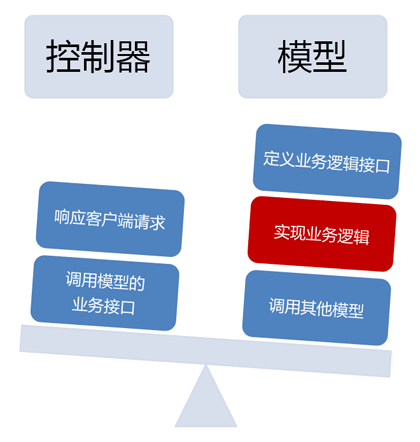
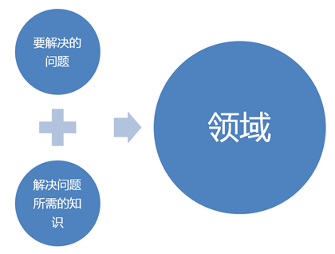

# 用对象来思考
QeePHP 是一个以“领域驱动设计”作为思想基础来架构和实现的开发框架，因此在 QeePHP 应用中，时刻记住以“面向对象”的思想来思考。

在常见的开发过程中，我们总是先设计数据表结构，然后再对数据表进行操作。而在 QeePHP 中，我们首先需要思考一个应用程序由哪些对象组成，以及该对象有哪些属性和行为，最后才是为存储对象创建合适的数据表。这和传统开发模式以“数据”为出发点的方式有了很大不同。

从上图可以看出，在开发 QeePHP 应用程序时，实际上是一个不断迭代的过程。首先以面向对象的思想来分析需求，然后设计出符合需求的对象，再创建存储对象需要的数据表。接下来，就是在对象中实现业务逻辑，并通过重构来不断迭代，最终得到高质量的应用程序。

面向对象是一个复杂的思想体系，关于如何进行面向对象的分析与设计，需要好几本书来阐述。所以本教程接下来的部分将略过理论性的内容，仅从实践步骤来展示面向对象的 QeePHP 应用程序开发过程。

## QeePHP 的优势

在 QeePHP 的架构中，模型（Model）扮演了极端重要的角色，是承载整个应用程序功能的核心组成部分。而大多数 PHP 框架中，模型都退化为了简单的数据库操作。在 QeePHP 应用中，模型的唯一用途就是封装业务逻辑，以便将逻辑从表现层中提取出来。

以下的两个示意图展示了 QeePHP 应用和基于其他框架的应用程序在本质上的不同：

`基于传统框架的应用`

`基于 QeePHP 的应用`

在 QeePHP 应用中，业务逻辑由模型实现。而模型的责任就是定义业务逻辑接口，以及实现业务逻辑（其中可能会调用其他模型），但是模型本身并不进行数据库操作。在传统的开发框架中，模型几乎就等同于数据库操作，而业务逻辑都在控制器中实现。

因此，与传统开发框架相比，QeePHP 应用程序中控制器的职责得到了显著简化。控制器仅仅响应客户端的请求，并且调用合适的模型来完成业务逻辑。QeePHP 的 MVC 真正实现了逻辑与表现的分离。模型充分实现了业务逻辑，而表现与交互都由控制器和视图配合完成。

## 领域驱动设计与开发

`这里对领域驱动设计概念和方法论进行了简化，完整的概念和方法论请阅读《领域驱动设计》一书。`

在我看来，领域可以理解为要解决的问题以及解决问题所需了解知识的集合。

比如创建财务软件，要解决的问题就是财务方面的。而解决这些问题需要的知识也是财务方面的。所以领域驱动开发的第一步“领域驱动设计”，通常是由精通该领域的专家来完成的。

领域驱动设计这个过程就是对领域的分解、提炼，从而整理出领域中包含的问题和概念。

在整理过程中，我们会找出解决问题的方法和流程，这些方法和流程就是我们常说的“业务逻辑”。而领域中包含的概念则大多会抽象为“模型”。

因此，领域驱动设计的本质就是从领域包含的问题和知识中抽象出软件需要的那部分。而领域驱动开发则是以领域驱动设计思想为基础的开发方式。

## 领域中的模型
在一个领域中，总是会包含一些非常重要的概念。例如“人事管理”领域中，“员工”就是一个重要的概念。而“财务管理”领域中，“帐户”也是一个重要的概念。这些领域中的重要概念，通常都会被抽象为“模型”。“员工”是模型，“帐户”也是模型。而“人事管理”领域的主要业务逻辑就是对“员工”模型进行操作。

虽然上面的阐述不够精确，但适用于大部分情况。在初次接触“领域驱动开发”时，可以遵循上述的原则来理解领域，并从领域中找出需要的模型。

在设计过程中，模型是用来和客户进行沟通的通用词汇。而在开发时，大部分模型会被转换为程序中的对象。事实上，在开发 QeePHP 应用程序时，大部分的精力都会花在模型对象上。一切的一切都是为了更好的定义模型和操作模型。

本章包含的知识非常多，建议有机会阅读《领域驱动设计 – 软件核心复杂性应对之道》一书，加强对领域驱动设计和开发的理解和运用。

