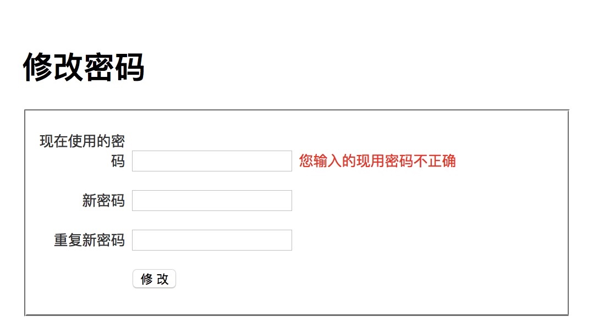
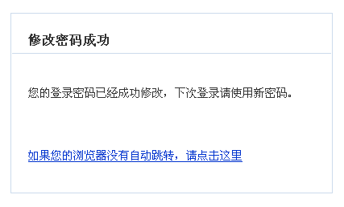

# 修改密码
通常，用户登录后修改自己的密码时都要求输入正在使用的密码。

## 添加控制器动作
修改 users 控制器，加入下列代码：

```php
function actionChangePasswd()
{
    $form = new Form_ChangePasswd();
     
    if ($this->_context->isPOST() && $form->validate($_POST))
    {
        try
        {
            // 取得当前用户的信息
            $current_user = $this->_app->currentUser();
            // 修改密码
            User::meta()->changePassword(
                $current_user['username'],
                $form['new_password']->value,
                $form['old_password']->value
                );
            // 重定向浏览器
            return $this->_redirectMessage(
                '修改密码成功',
                '您的登录密码已经成功修改，下次登录请使用新密码。',
                url('default/index'));
        }
        catch (AclUser_WrongPasswordException $ex)
        {
            $form['old_password']->invalidate('您输入的现用密码不正确');
        }
    }

    $this->_view['form'] = $form;

}
```

## 实现修改密码表单
在 Web 应用中，表单需要完成下面的主要任务：

* 容纳从客户端提交的数据
* 对客户端提交的数据进行过滤
* 对客户端提交的数据进行验证
* 导出过滤和验证后的数据
* 构造出在浏览器中需要的 HTML 代码

为了提供更好的灵活性，并且简化表单的使用，QeePHP 将上述几项任务分为多个不同的部分：

* QForm 负责构造表单元素容器
* 表单元素负责容纳数据，并数据进行过滤和验证
* 通过 QeePHP 的用户界面控件构造表单 HTML 代码

在 QeePHP 应用中使用表单，典型的过程如下：

1. 创建表单，定义表单需要容纳的数据，以及过滤和验证规则
2. 在控制器动作中构造表单对象，并导入数据进行过滤和验证
3. 在视图中构造表单的 HTML 代码，或者通过视图片段构造表单 HTML 代码

搞清楚了基本概念，我们就来一步步实现用户注册表单。

## 创建表单对象

新建文件 app/form/changepasswd.php，内容如下：


```php
class Form_ChangePasswd extends QForm
{
    
    function __construct()
    {
        
        // 调用父类的构造函数
        parent::__construct('form_changepasswd');

        // 从配置文件载入表单
        //$filename = rtrim(dirname(__FILE__), '/\\') . DS . 'changepasswd_form.yaml';
        //$this->loadFromConfig(Helper_YAML::loadCached($filename));
        
        //也可以直接定义配置数组
        $fields = array('old_password'=> array(),'new_password' => array(), 'new_password2' => array());
        $this->loadFromConfig($fields);
      
        // 三个密码字段按照 User 模型的 password 属性来验证
        $this['old_password']->addValidations(User::meta(), 'password');
        $this['new_password']->addValidations(User::meta(), 'password');
        // 但 new_password2 字段还有一个额外的验证规则，
        // 通过 Form_ChangePasswd 对象的 checkNewPassword() 方法进行验证
        $this['new_password2']->addValidations(User::meta(), 'password')
        ->addValidations(array($this, 'checkNewPassword'), '两次输入的密码必须一致');
    }

    /**
     * 检查两次输入的新密码是否一致
     */
    function checkNewPassword($new_password)
    {
        return ($this['new_password2']->value == $this['new_password']->value);
    }

}
```

三个密码输入字段使用了User 模型的password属性的验证规则， `addValidations(User::meta(), 'password')`方法的 `User::meta()`返回的是User模型的一些源信息，其中就包括User模型的字段和字段的验证规则，第二个参数指定按 User模型的passowrd 属性验证规则来验证，还特别增加一个额外的验证规则。checkNewPassword() 这个方法被用于对 new_password2 字段的验证。这样可以检查两次输入的新密码是否一致。

对于复杂表单的自定义验证规则，都可以采用上述方式实现。

船舰修改密码表单的配置文件 app/form/changepasswd_form.yaml：


## 添加控制器动作

修改 users 控制器，加入下列代码：


```php
function actionChangePasswd()
{
    $form = new Form_ChangePasswd();
     
    if ($this->_context->isPOST() && $form->validate($_POST))
    {
        try
        {
            // 取得当前用户的信息（来自session）
            $current_user = $this->_app->currentUser();
            // 修改密码
            User::meta()->changePassword(
                $current_user['username'],
                $form['new_password']->value,
                $form['old_password']->value
                );
            // 重定向浏览器
            return $this->_redirectMessage(
                '修改密码成功',
                '您的登录密码已经成功修改，下次登录请使用新密码。',
                url('default/index'));
        }
        catch (AclUser_WrongPasswordException $ex)
        {
            //手动设置old_password验证不通过，并且指定错误提示
            $form['old_password']->invalidate('您输入的现用密码不正确');
        }
    }

    $this->_view['form'] = $form;
}
```

actionChangePasswd() 中，我们使用 acluser 的 changePassword() 方法来修改密码。如果现有密码出错，将抛出异常。只要捕获异常就可以在界面提示用户输入出错了。

## 建立视图
创建文件 app/view/users/changepasswd.php，内容为：


```html
<?php $this->_extends('_layouts/default_layout'); ?>
 
 
<!-- // 定义一个名为 contents 的区块 -->
<?php $this->_block('contents'); ?>

<form name="form_user" id="form_user" action="<?php echo url('users/changepasswd'); ?>" method="post">
 <h1>修改密码</h1>
  <fieldset>
    <p>
      <label for="username">现在使用的密码</label>
      <input type="password" name="old_password" id="old_password" />
      <span class="error"><?php echo $form['old_password']->isValid() ? "" :  $form['old_password']->errorMsg()[0];?></span>
    </p>
    
    <p>
      <label for="password">新密码</label>
      <input type="password" name="new_password" id="new_password" />
      <span class="error"><?php echo $form['new_password']->isValid() ? "" :  $form['new_password']->errorMsg()[0];?></span>
    </p>
 
    <p>
      <label for="password">重复新密码</label>
      <input type="password" name="new_password2" id="new_password2" />
      <span class="error"><?php echo $form['new_password2']->isValid() ? "" :  $form['new_password2']->errorMsg()[0];?></span>
    </p> 
    
    <p> 
      <label> </label>
      <input type="submit" name="Submit" value="修 改" />
    </p>
 
  </fieldset>
 
</form>

<?php $this->_endblock(); ?>
```

`$form` 是个继承了`ArrayAccess`接口的表单对象实例，所以可以通过数组下标形式访问其内部的表单元素对象实例，例如`$form['old_password']`访问到的是old_password表单对象，然后调用他的实例方法`isValid()`判断该字段验证是否通过，不通过调用errorMsg()方法返回验证失败的所有错误信息（它是个数组）。

输入错误的现在使用密码将会提示错误如图：




注意这次在重定向浏览器时调用的是 `_redirectMessage() `方法。这个方法会通过 `redirect_message` 视图来显示提示信息，能够让用户注意到操作的结果。如果有必要，可以将注册、登录等方法的重定向操作也改为使用带提示信息的重定向。集体源码可以参考`app/controller/abstract.php`文件。



现在用户方面的功能就基本上实现完了。下一节开始，我们将实现任务的管理功能。


