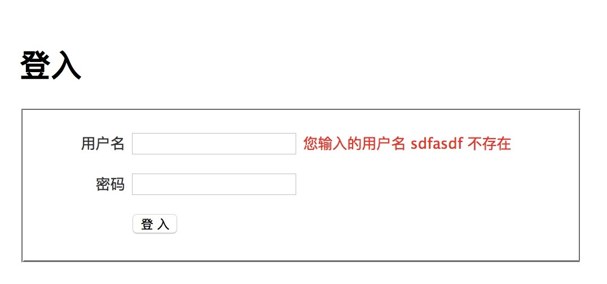
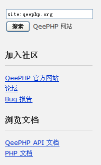
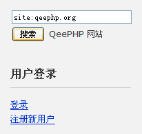
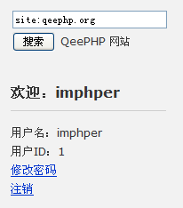

# 用户登录和注销
通过前面实现用户注册功能，我们了解了如何完善模型及创建表单。这一个小节我们来实现用户的登录和注销功能。
## 实现登录
修改 users 控制器，加入下列代码：

```php
$form_error = array();
    
if ($this->_context->isPOST() &&  empty($form_error = User::meta()->validate($_POST)))
{
   try
   {
       // 使用 acluser 插件的 validateLogin() 方法验证登录并取得有效的 user 对象
       $user = User::meta()->validateLogin($this->_context->post('username'), $this->_context->post('password'));
       // 将登录用户的信息存入 SESSION，以便应用程序记住用户的登录状态
       $this->_app->changeCurrentUser($user->aclData(), 'MEMBER');
       // 登录成功后，重定向浏览器
       return $this->_redirect(url('default/index'));
   }
   catch (AclUser_UsernameNotFoundException $ex)
   {
       $form_error['username'][] = ("您输入的用户名 {$this->_context->post('username')} 不存在");
   }
   catch (AclUser_WrongPasswordException $ex)
   {
       $form_error['password'][] = ("您输入的密码不正确");
   }
}
	
 
  $this->_view['form_error'] = $form_error;
```

这段代码中有两个地方需要说明一下。

## 调用行为插件的方法

acluser 行为插件为模型扩展了多个方法，包括：

| 方法名	| 用途 |	类型 |
| --- | --- | --- |
| validateLogin() |	验证用户登录并返回用户对象 |	类方法 |
| validateUsername() |	验证用户名	| 类方法 |
| validatePassword() | 验证用户名和密码	| 类方法 |
| changePassword()	| 修改指定用户的密码	| 类方法 |
| checkPassword() |	检查指定的密码是否与当前用户的密码相符	| 实例方法 |
| changePassword()	| 修改当前用户的密码	| 实例方法 |
| updateLogin() |	 更新用户的登录信息 | 	实例方法|
| aclRoles() |	获得包含用户所有角色名的数组 	| 实例方法 |
| aclData()	 |获得用户的 ACL 数据	| 实例方法 |


**类方法**是指调用该方法不需要构造模型**对象实例**，而实例方法则只能通过模型对象实例来调用。

要调用一个类方法：

```php
User::meta()->validateLogin();
```
调用一个实例方法则是：

```php
$user->changePassword();
```

可以看出，类方法必须通过 meta() 方法返回的连贯接口来调用。

在用户登录中，我们用到了 acluser 插件提供的 validateLogin() 类方法，所以调用方式就是：

```php
$user = User::meta()->validateLogin($form['username']->value, $form['password']->value);
```

validateLogin() 方法检查用户名和密码的正确性，如果检查通过就返回有效的用户对象，否则抛出不同的异常。通过拦截异常我们就可以给用户反馈合适的错误信息。
>acluser 插件源码在 qeephp框架的 library/extend/behavior/acluser.php中，看源码和代码注释掌握使用方法，后面的教程我们将讲解如何开发新的行为插件

## 记住用户的登录状态
登录成功，我们必须让应用程序记住用户的登录状态，不然用户一刷新页面，又变成未登录了。在 QeePHP 自动生成的应用程序对象中，已经提供了一系列方法来完成这项工作：

| 方法名 | 用途 |
| --- | --- |
| changeCurrentUser	 |将用户数据保存到 session 中|
| currentUser()	| 获取保存在 session 中的用户数据 |
| currentUserRoles()	| 获取 session 中用户信息包含的角色 |
| cleanCurrentUser()	| 从 session 中清除用户数据 |

所以要让应用程序记住用户的登录状态，调用 changeCurrentUser() 方法就可以了。

>具体可以查看项目文件 app/myapp.php 源码了解更多。

## 添加登录需要的视图
我们还没有添加登录页面需要的视图，不过由于登录和注册的页面内容几乎一样，所以我们直接把注册的视图复制到 login.php 视图页面。修改下标题为登入即可。修改好后，访问 [http://localhost/todo/public/index.php?controller=users&action=login]()测试一下登录功能吧。


## 实现注销
既然有登录，就有注销，在 users 控制器新增方法 actionLogout()：

```php
function actionLogout()
{
    // 清除当前用户的登录信息
    $this->_app->cleanCurrentUser();
    // 重定向浏览器
    return $this->_redirect(url('default/index'));
}
```

## 在用户界面上显示登录状态
现在注册、登录和注销功能都做好了，但是用户界面上还没有相应的链接，而且也没有显示出用户的登录状态。

在编码之前，我们可以打开 app/view/_layouts/default_layout.php 文件来看看。可以看到其中有一行：

```php
<?php $this->_element('sidebar'); ?>
```

这行代码载入了一个名为 sidebar 的视图片段，显示出来的效果就是：


在视图中，可以用“$this->_element(片段名)”来载入一个视图片段，该视图片段存储为“app/view/_elements/片段名_element.php”文件。例如“sidebar”视图片段对应的文件名就是“app/view/_elements/sidebar_element.php”。

视图片段通常用于一些在各个页面都会重复出现的内容，例如页头、页脚等。合理使用视图片段可以极大减少视图中存在的重复代码。不过视图片段并不能够处理自己需要的数据，所以像显示当前用户登录信息这样的需求，我们需要使用用户界面控件。

## 用户界面组件化
在前面的章节中，看到如何通过视图的继承和区块来分拆用户界面，最终获得各个可以重用的部分。而用户界面控件就是一种更强大的手段，可以将用户界面上的一个独立区域封装起来。

这个区域不但有自己的表现，还可以有自己的数据。例如“最新10个回复”这个控件可以自己查询最新的 10 个回复数据，然后载入自己的视图来构造 HTML 代码。而在传统开发模式中，如果某个页面需要“最新10个回复”这个区域，就必须在该页面对应的控制器动作中查询需要的数据。最终，各个控制器动作中都重复着相同的代码。

QeePHP 利用用户界面控件机制，彻底解决了这个问题，完全符合 DRY 原则。现在我们来把 sidebar 这个视图片段转换为一个用户界面控件。

用户界面通常由控件类和控件视图两部分组成。控件类都放置在 app/control/ 目录中。我们现在新建文件 app/control/sidebar.php 文件，内容如下：

```php
class Control_Sidebar extends QUI_Control_Abstract
{
    function render()
    {
        // 从对象注册表中查询 app 对象
        $app = Q::registry('app');
        // 取得当前用户的信息
        $this->_view['current_user'] = $app->currentUser();
        // 渲染视图并返回结果
        return $this->_fetchView(dirname(__FILE__) . '/sidebar_view');
    }
}
```

然后将文件 app/view/_elements/sidebar_element.php 移动到 app/control/ 目录，并改名为 sidebar_view.php。打开该文件，在适当位置添加如下内容：


```php
<?php if (empty($current_user)): ?>
 
    <li>
      <h3>用户登录</h3>
      <ul class="links">
        <li><a href="<?php echo url('users/login'); ?>">登录</a></li>
        <li><a href="<?php echo url('users/register'); ?>">注册新用户</a></li>
      </ul>
    </li>
 
<?php else: ?>
 
    <li>
      <h3>欢迎：<?php echo h($current_user['username']); ?></h3>
      <ul class="links">
        <li>用户名：<?php echo h($current_user['username']); ?></li>
        <li>用户ID：<?php echo ($current_user['id']); ?></li>
        <li><a href="<?php echo url('users/changepasswd'); ?>">修改密码</a></li>
        <li><a href="<?php echo url('users/logout'); ?>">注销</a></li>
      </ul>
    </li>
 
<?php endif; ?>
```

最后，修改 app/view/_layouts/default_layout.php 文件，将：

```php
<?php $this->_element('sidebar'); ?>
```

改为： 

```php
<?php $this->_control('sidebar'); ?>
```

刷新浏览器，并尝试登录和注册，观察侧边栏的变化：

**未登录：**


**已登录:**



