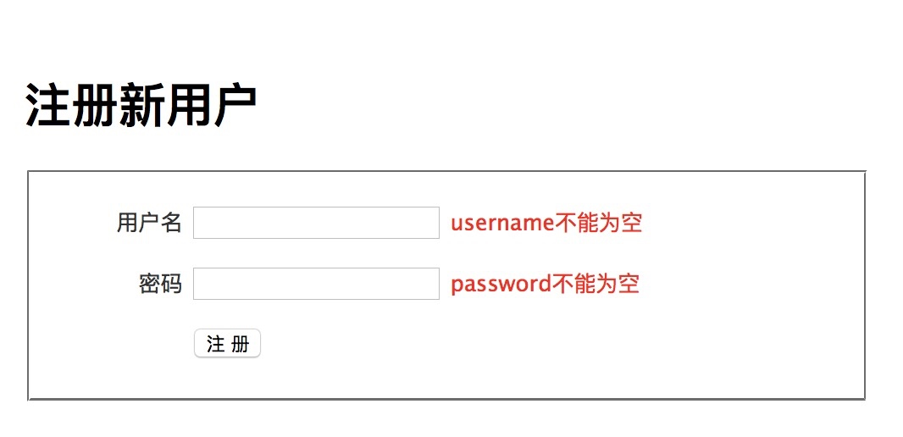
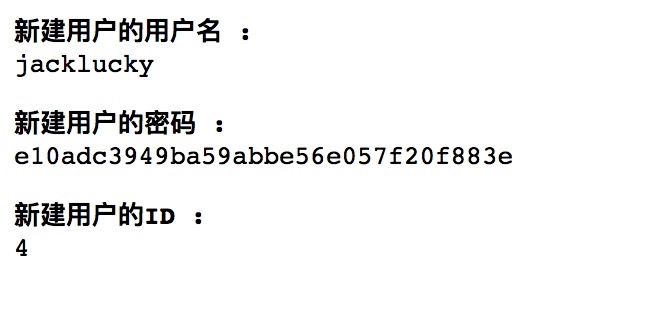
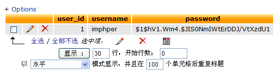

# 实现用户注册（功能实现）
在前面的小结中，我们主要学习了怎么使用视图。现在我们来解决表单提交，以及模型的创建问题。

## 丑陋的表单提交处理代码
修改 controller/users.php 文件，加入以下代码：

```php
function actionRegister()
{
    // 从 POST 中提取用户名和密码
    $username = trim(strtolower(isset($_POST['username']) ? $_POST['username'] : ''));
    $password = isset($_POST['password']) ? $_POST['password'] : '';
 
    // 对输入数据进行验证
    $errors = array();
    if (strlen($username) < 5)
    {
        $errors['username'][] = '用户名不能少于 5 个字符';
    }
    if (strlen($username) > 15)
    {
        $errors['username'][] = '用户名不能超过 15 个字符';
    }
 
    if (strlen($password) < 6)
    {
        $errors['password'][] = '密码不能少于 6 个字符';
    }
 
    ..... 更多的验证代码
 
    ..... 检查用户名是否重复
    ..... 检查保存是否成功
    ..... 如果失败，将错误信息存入视图
    ..... 如果失败，将 POST 信息存入视图，以便在表单中重新显示提交的内容
}
```

上述代码可能和过去的做法类似，但是这些代码看着不恶心吗？

QeePHP 为表单提供了全面支持，并且允许开发者将表单和模型结合起来使用。这样一来，表单数据的过滤、验证，以及错误处理都可以自动完成，不需要开发者手工编码实现。关于如何使用表单，有专门的章节详细阐述。这里我们只简单的展示一下使用 QeePHP 表单模型带来的优势。


## 完善模型定义

时刻记住一点，QeePHP 是一个遵循“领域驱动开发”思想的框架。而领域驱动中，最重要的就是模型。而我们的大多数表单都是和模型有关的，所以在处理表单之前，首先要完善模型的定义。因为这些定义可以直接套入表单对象中，避免我们在不同的地方编写同样的逻辑，这就是 DRY 原则的最佳实践。

先前创建的 User 模型只是半成品，现在我们需要对其进行完善。一个模型由几个方面组成：

* 属性：定义模型有哪些属性、属性的类型以及属性的行为和验证规则等
* 行为：添加实现业务逻辑需要的方法，让模型逐步逼近实际的需求
* 数据：由属性和存储模型属性的数据表组成，但属性不一定要和数据表一一对应
* 关系：模型需要互相配合来实现业务需求，因此关系也是模型的一部分

## 完善模型的属性
打开模型的定义文件，在 __define() 方法中可以找到模型的详细定义。这些定义分为几个部分：

* 指定存储模型使用的数据表
* 属性和关联的定义，例如只读属性、虚拟属性、关联等
* 对属性的验证规则
* 安全性方面的定义
* 行为插件的定义

在 QeePHP 的模型中，属性本身具有多种特性：

* 是否是只读属性
* 是否是虚拟属性
* 是否有 getter 或 setter 方法
* 类型
* 验证规则

`对于 todo 这样的简单应用，我们用不到这么多高级特性，所以上述内容了解一下就行了。`

todo 应用中，user 模型只有两个主要属性：用户名和密码。根据需求，这两个属性有下列要求：

* 用户名应该是唯一的
* 用户一旦成功创建，就不能更改用户名，因此用户名必须是只读属性
* 用户名不能少于 5 个字符，不能多于 15 个字符，并且只能使用字母和数字组成
* 密码不能少于 6 个字符，不能多于 20 个字符
* 密码应该加密存储

现在我们一步步来实现这些要求。

修改 __define() 方法，禁止更新用户名：


```php
'props' => array(
    .....
    // 指定 username 属性为只读
    'username' => array('readonly' => true),
    .....
),
 
/**
 * 指定更新数据库中的对象时，哪些属性的值不允许由外部提供
 */
'update_reject' => 'username',
```

继续：

```php
'validations' => array
(
    // 指定 username 属性的验证规则
    'username' => array
    (
        array('not_empty', '用户名不能为空'),
        array('min_length', 5, '用户名不能少于 5 个字符'),
        array('max_length', 15, '用户名不能超过 15 个字符'),
        array('is_alnum', '用户名只能由字母和数字组成'),
    ),
 
    // 指定 password 属性的验证规则
    'password' => array
    (
        array('not_empty', '密码不能为空'),
        array('min_length', 6, '密码不能少于 6 个字符'),
        array('max_length', 20, '密码不能超过 20 个字符'),
    ),
),
```

经过简单的设置，大部分要求都可以由 QeePHP 来处理了，剩下的密码加密存储则可以借助现成的 acluser 行为插件来实现。


## 行为插件
虽然我们可以通过给 password 属性添加 getter 和 setter 方法来实现密码的加密，但 QeePHP 已经提供了现成的插件来帮助我们完成类似工作，并且提供了更丰富的特性。

acluser 行为插件应用到一个模型后，可以实现下列特征：

* 密码属性的自动加密
* 验证用户名和密码的正确性
* 验证用户名的唯一性
* 查询用户的基本属性和角色信息

要使用 acluser 插件，只需要修改 __define() 方法：


```php
// 指定该 ActiveRecord 要使用的行为插件
'behaviors' => 'acluser',
 
// 指定行为插件的配置
'behaviors_settings' => array
(
    # '插件名' => array('选项' => 设置),
    'acluser' => array(
        'acl_data_props' => 'username',
    ),
),
```
acluser 插件的详细文档请参考后续文档
指定好 acluser 插件后，我们的 user 模型在属性方面就完善了。

## 完善模型的行为和关系
根据前面的需求分析，user 模型具有下列行为：

| 行为 | 说明 |
|---|---|
| validateLogin	| 验证用户名和密码 |
| createTask	| 创建属于该用户的任务 |
| loadTasks	 | 载入属于该用户的任务 |

由于 acluser 插件已经提供了验证用户名和密码的方法，validateLogin() 方法不需要我们自己实现了。下面来实现 createTask() 和 loadTasks() 方法。

修改 user 模型的类，加入下列代码：

```php
class User extends QDB_ActiveRecord_Abstract
{
 
    /**
     * 创建属于当前用户的任务
     *
     * @return Task
     */
    function createTask($subject, $description = null)
    {
        $task = new Task();
        $task->owner       = $this;
        $task->subject     = $subject;
        $task->description = $description;
        return $task;
    }
 
    .....
}
```

而 loadTasks() 方法也不需要我们去实现，因为 QeePHP 的 ORM 可以让我们直接通过属性访问一个模型关联的其他模型。所以我们只需要修改 __define() 方法，加入 user 模型和 task 模型的关联就可以了：


```php
'props' => array(
    .....
    'tasks' => array(QDB::HAS_MANY => 'Task', 'target_key' => 'user_id'),
    .....
),
```


OK，现在用户模型已经准备好了。


## 准备表单视图
QeePHP中有表单控件模块，但是使用起来有些繁琐不够灵活，后续会介绍他的使用方法，所以我们直接使用HTML写表单视图。在
app/view/users/register.php 文件的内容为：


```html
<?php $this->_extends('_layouts/default_layout'); ?>

<?php $this->_block('contents'); ?>

<form name="form_user" id="form_user" action="<?php echo url('users/register'); ?>" method="post">
 <h1>注册新用户</h1>
  <fieldset>
    <p>
      <label for="username">用户名</label>
      <input type="text" name="username" id="username" />
      <span class="error"><?php echo isset($form_error['username']) ? array_shift($form_error['username']) : '';?></span>
    </p>
    
    <p>
      <label for="password">密码</label>
      <input type="password" name="password" id="password" />
      <span class="error"><?php echo isset($form_error['password']) ? array_shift($form_error['password']) : '';?></span>
    </p>
 
    <p> 
      <label> </label>
      <input type="submit" name="Submit" value="注 册" />
    </p>
 
  </fieldset>
 
</form>

<?php $this->_endblock(); ?>
```
>记得在 todo/public/css/style.css 文件中加入表单样式

```css
/*Add style*/
form p label{display:inline-block; width: 80px; text-align:right; vertical-align: top;}
form p span.error{ color:red;}
```

## 实现用户登录

修改 users 控制器的 actionRegister() 方法为：


```php
$form_error = array();
   
if ($this->_context->isPOST() && empty($form_error = User::meta()->validate($_POST)) )
   {
       // 是 POST 提交，并且表单验证通过（借助User模型验证规则对表单数据进行验证，但这不是必须的，具体情况具体分析）
       try
       {
           // 创建 user 对象、通过构造函数批量对模型赋值，并保存
           $user = new User($this->_context->post());
           $user->save();
     
           // 成功后输出新建用户对象的信息
           dump($user->username, '新建用户的用户名');
           dump($user->password, '新建用户的密码');
           dump($user->id(), '新建用户的ID');
           exit;
       }
       catch (AclUser_DuplicateUsernameException $ex)
       {
           // 捕获 AclUser_DuplicateUsernameException 异常，在表单中指出用户名存在重复问题
           $form_error['username'][] = "您要注册用户名 {$user->username} 已经存在了";
       }
   }

   // 将表单对象传递给视图
   $this->_view['form_error'] = $form_error;
```

现在用浏览器访问 http://localhost/todo/public/index.php?controller=users&action=register ，然后不输入任何内容就点击“提交”按钮，将可以看到如下界面：




现在输入用户名为：jacklucky，密码为 123456，提交后会看到如下内容：




通过 phpMyAdmin 可以看到刚刚输入的信息已经存入数据库了：




为了方便后续开发，我们再修改一下 users 控制器的 actionRegister() 方法：

```php
// 成功后输出新建用户对象的信息
dump($user->username, '新建用户的用户名');
dump($user->password, '新建用户的密码');
dump($user->id(), '新建用户的ID');
exit;
```
改为：

```php
// 登录成功后，重定向浏览器
return $this->_redirect(url('default/index'));
```

现在读者朋友们可以发挥自己的想象力，尝试输入不同的内容来测试表单的验证规则、过滤器设置，以及对重复用户名的检查 :)

