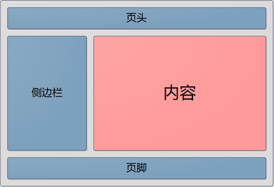
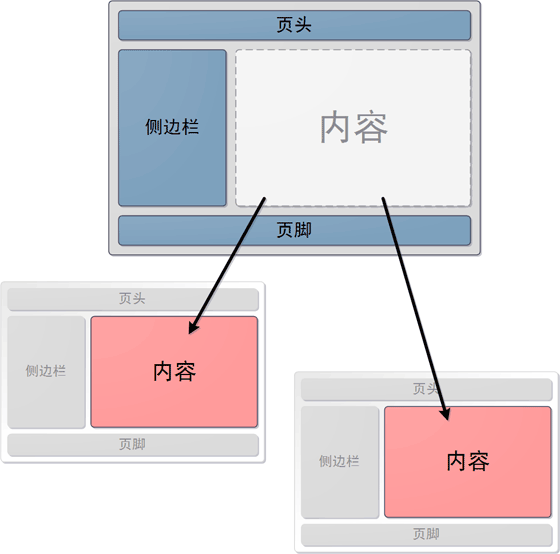

# 实现用户注册（用户界面）
根据我们最开始的分析，todo 应用应该允许用户注册、登录，然后创建自己的任务列表。用户注册这个功能流程很简单，用流程图表示如下：

这个功能我们使用 users 控制器的 register 动作来完成，所以首先通过 WebSetup 创建 users 控制器。并在 users 控制器中添加如下代码：

```php
function actionRegister()
{
}
```
现在通过浏览器访问 http://localhost/todo/public/index.php?controller=users&action=register 还只能看到一片空白，因为我们还没有为 register 动作方法提供对应的视图文件。

## 创建视图

在 QeePHP 应用程序中，视图的功能就如其名称暗示的一样，是用来显示给用户看的。大多数情况下，视图都是包含大量 HTML 代码的 PHP 文件。我们可以在视图中输出变量内容，以便将操作结果展示给用户。

register 动作的操作结果就是显示一个“用户注册”表单。因此创建 app/view/users/register.php 文件，内容如下：


```php
<form name="form_user" id="form_user" action="<?php echo url('users/register'); ?>" method="post">
 
  <fieldset>
    <p>
      <label for="username">用户名</label>
      <input type="text" name="username" id="username" />
    </p>
 
    <p>
      <label for="password">密码</label>
      <input type="password" name="password" id="password" />
    </p>
 
    <p>
      <input type="submit" name="Submit" value="提交" />
    </p>
 
  </fieldset>
 
</form>
```
现在刷新浏览器，就可以看到注册表单了。但是我们会发现浏览器中的 HTML 源代码是不合法的。因为连 head、body 等基本元素都没有。

## url() 函数
在视图中，我们使用了 url() 函数。这个函数在 QeePHP 框架中承担着非常重要的职责：生成有效的 URL 地址。

在 Web 应用程序中，URL 地址的重要性无论如何强调都不过分。而在 QeePHP 中，URL 中特定参数将被 MVC 模式用于访问特定控制器和动作。为了能够生成有效的 URL 地址，QeePHP 框架提供了 url() 函数。

url() 函数有多种用法，但最常用的用法只需要两个参数：

| 参数 | 用途 |
|---|---|
| $udi	| 指定 URL 地址对应的 UDI |
| $args	| 要在 URL 中传递的附加参数 |

这里提到的 UDI 是统一目的地标识符（Uniform Destination Identifier）的缩写。UDI 由控制器、动作、名字空间以及模块名组成，采用如下的格式：


```
namespace::controller/action@module
```
UDI 字符串中，每一个部分都是可选的。如果没有提供控制器和动作名，则使用默认的控制器（default）和动作名（index）代替。

UDI 字符串写法示例：


```sql
?controller
?controller/action
?/action
?controller@module
?controller/action@module
?namespace::controller
?namespace::controller/action
?namespace::controller@module
?namespace::controller/action@module
?@module
?namespace::@module
```

由于本教程没有用到名字空间和模块，所以整篇教程中出现的 UDI 都是“tasks/create”、“users/login”这样的形式。

## 视图的继承
在传统开发模式中，视图是个不被人重视的地方。配合 Smarty 之类的模板引擎，将页面分割成多个子模板就算不错了。但是随着现代 Web 应用的复杂度越来越高，对用户界面的要求也变得更严格，传统做法的工作量和灵活性都很不理想。

参考下面的示意图，可以看到一个页面中，除了中间的内容部分外，页头、侧边栏、页脚在其他页面中都是可以重复使用。那么我们为什么不能引入面向对象中的继承思想，让视图也可以继承呢？




使用模板继承后，我们把整个页面作为一个父模板，而各个页面对应的模板做成子模板，子模板从父模板继承。



## 完成视图

虽然没有特别要求，但惯例上将包含页面整体结构的视图称为“布局视图”。在 todo 应用中，为了简单起见，我们就不制作新的布局视图了，直接沿用生成应用时自动创建的布局视图。

修改 register.php 文件，顶部加入下列代码：

```php
// 指示该视图从 _layouts/default_layout 继承
<?php $this->_extends('_layouts/default_layout'); ?>
 
// 定义一个名为 contents 的区块
<?php $this->_block('contents'); ?>
```

在 register.php 文件底部加入：

```php
<?php $this->_endblock(); ?>
// contents 区块定义结束
```

修改完成后刷新浏览器，可以看到现在的页面不但有 register.php 中添加的表单内容，还有完整的页头、侧边栏和页脚。


## 指定要继承的视图
新增的代码中， _extends() 方法表示当前视图从哪一个视图继承。打开 _layouts/default_layout.php 可以看到这里定义了完整的页面结构。注意 _extends() 方法指定的视图名字不需要包含扩展名。因为 QeePHP 支持多种模板引擎，而每种模板引擎使用的文件扩展名都有所不同。

## 通过定义区块来覆盖父模板中的内容
在新增代码中，出现了 _block() 和 _endblock() 两个方法。这两个方法总是成对出现的，用来定义一个“区块”。每一个区块都有名称，因此 _block() 方法需要提供区块名称作为参数。在子模板中定义的区块，区块的内容会替换掉父模板中同名区块的内容。

打开 _layouts/default_layout.php 父模板可以看到如下代码：

```php
<?php $this->_block('contents'); ?><?php $this->_endblock(); ?>
```
这里定义了一个名为“contents”的区块。由于子模板中也定义了同名区块，所以子模板中的内容就将父模板的“contents”区块内容替换掉了，最终获得了完整的输出内容。

利用这个特性，我们可以实现非常灵活的视图。例如在文章显示页面，将文章标题添加到页面的 title 标签中：

```php
// 父模板
<title>这是我的网站 - <?php $this->_block('title'); ?>欢迎<?php $this->_endblock(); ?></title>
```


```php
// 子模板
<?php $this->_block('title'); ?><?php echo h($article->title); ?><?php $this->_endblock(); ?>
```
当显示文章页面时，文章页面视图中定义的“title”区块就会替换掉父模板中的内容。从而页面标题就变成了“这是我的网站 – 文章的标题”。而在没有定义“title”区块的子模板中，父模板“title”区块的内容则会被保留。

除了继承和区块，QeePHP 的视图还提供了其他非常有使用价值的特征。我们会在教程接下来的内容中为大家逐步呈现。


